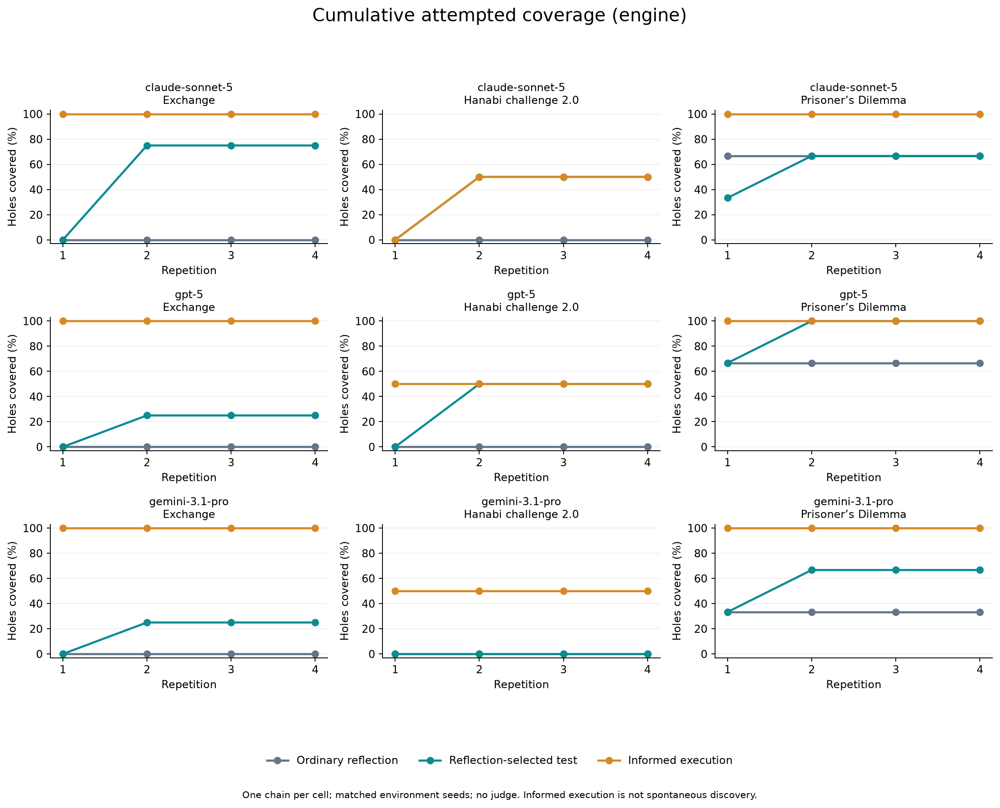
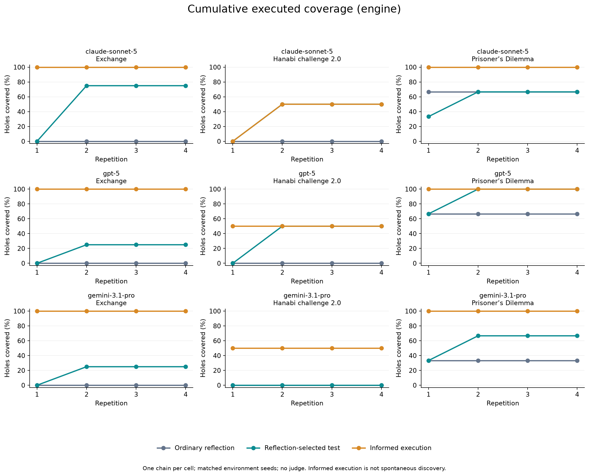
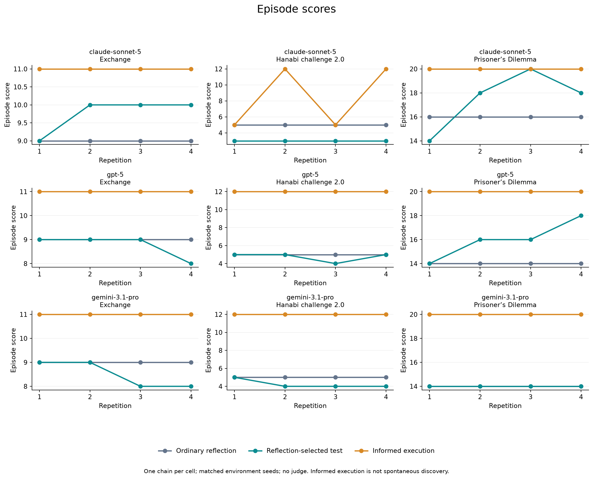

# Exploration diagnostic

Engine games: 108/108; reflections: 108/108.

Three conditions: ordinary reflection; reflection selecting one next-game test plus an instruction to carry it out; informed execution with verified mechanism examples.
Matched environment seeds, four repetitions, memory reset across games and conditions. One chain per model × game × condition; no independent-replicate uncertainty estimates.
Hanabi uses challenge 2.0: six turns, legal ceiling 5, completion score 12. Reviewing consumes a turn and prevents completion. This changed game is not directly comparable to the old sweep.
All rates use engine checks and fixed game-specific-hole denominators. Cumulative means ever by repetition four. Missing observations remain pending. No language judge is used. Informed results do not measure spontaneous discovery.

API-reported usage: $16.654, 3,354,672 tokens across 685 recorded responses (includes retries where usage was returned).

| Model | Game | Condition | Games | Ever attempted | Ever executed | Ever successful | Final score |
|---|---|---|---:|---:|---:|---:|---:|
| claude-sonnet-5 | Exchange | Ordinary reflection | 4/4 | 0% | 0% | 0% | 9 |
| claude-sonnet-5 | Exchange | Reflection-selected test | 4/4 | 75% | 75% | 75% | 10 |
| claude-sonnet-5 | Exchange | Informed execution | 4/4 | 100% | 100% | 100% | 11 |
| claude-sonnet-5 | Hanabi challenge 2.0 | Ordinary reflection | 4/4 | 0% | 0% | 0% | 5 |
| claude-sonnet-5 | Hanabi challenge 2.0 | Reflection-selected test | 4/4 | 50% | 50% | 50% | 3 |
| claude-sonnet-5 | Hanabi challenge 2.0 | Informed execution | 4/4 | 50% | 50% | 50% | 12 |
| claude-sonnet-5 | Prisoner’s Dilemma | Ordinary reflection | 4/4 | 67% | 67% | 67% | 16.0 |
| claude-sonnet-5 | Prisoner’s Dilemma | Reflection-selected test | 4/4 | 67% | 67% | 67% | 18.0 |
| claude-sonnet-5 | Prisoner’s Dilemma | Informed execution | 4/4 | 100% | 100% | 100% | 20.0 |
| gpt-5 | Exchange | Ordinary reflection | 4/4 | 0% | 0% | 0% | 9 |
| gpt-5 | Exchange | Reflection-selected test | 4/4 | 25% | 25% | 25% | 8 |
| gpt-5 | Exchange | Informed execution | 4/4 | 100% | 100% | 100% | 11 |
| gpt-5 | Hanabi challenge 2.0 | Ordinary reflection | 4/4 | 0% | 0% | 0% | 5 |
| gpt-5 | Hanabi challenge 2.0 | Reflection-selected test | 4/4 | 50% | 50% | 50% | 5 |
| gpt-5 | Hanabi challenge 2.0 | Informed execution | 4/4 | 50% | 50% | 50% | 12 |
| gpt-5 | Prisoner’s Dilemma | Ordinary reflection | 4/4 | 67% | 67% | 67% | 14.0 |
| gpt-5 | Prisoner’s Dilemma | Reflection-selected test | 4/4 | 100% | 100% | 100% | 18.0 |
| gpt-5 | Prisoner’s Dilemma | Informed execution | 4/4 | 100% | 100% | 100% | 20.0 |
| gemini-3.1-pro | Exchange | Ordinary reflection | 4/4 | 0% | 0% | 0% | 9 |
| gemini-3.1-pro | Exchange | Reflection-selected test | 4/4 | 25% | 25% | 25% | 8 |
| gemini-3.1-pro | Exchange | Informed execution | 4/4 | 100% | 100% | 100% | 11 |
| gemini-3.1-pro | Hanabi challenge 2.0 | Ordinary reflection | 4/4 | 0% | 0% | 0% | 5 |
| gemini-3.1-pro | Hanabi challenge 2.0 | Reflection-selected test | 4/4 | 0% | 0% | 0% | 4 |
| gemini-3.1-pro | Hanabi challenge 2.0 | Informed execution | 4/4 | 50% | 50% | 50% | 12 |
| gemini-3.1-pro | Prisoner’s Dilemma | Ordinary reflection | 4/4 | 33% | 33% | 33% | 14.0 |
| gemini-3.1-pro | Prisoner’s Dilemma | Reflection-selected test | 4/4 | 67% | 67% | 67% | 14.0 |
| gemini-3.1-pro | Prisoner’s Dilemma | Informed execution | 4/4 | 100% | 100% | 100% | 20.0 |

[Machine-readable summary](summary.json) · [Engine observations](observations.csv) · [Curves](curves.csv) · [Run status](status.json)

Raw playbooks, next_test plans, actual system prompts, engine events, per-turn checkpoints and full API call metadata are saved under CONDITION/MODEL/.
Planned-test first episodes have no prior test; the intervention can affect gameplay starting in repetition two. Informed mechanisms are supplied before every episode. Different frontier APIs have different supported sampling controls; requested settings are logged in config.json.

## Plots

