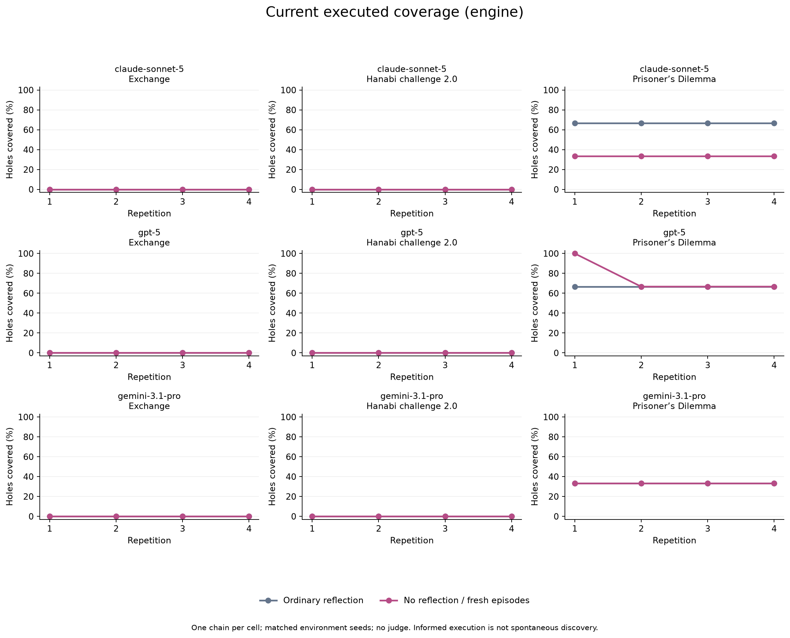
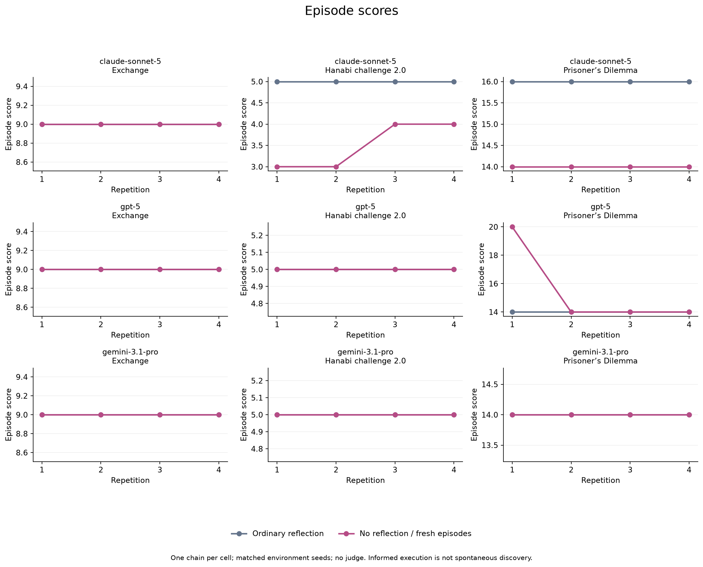
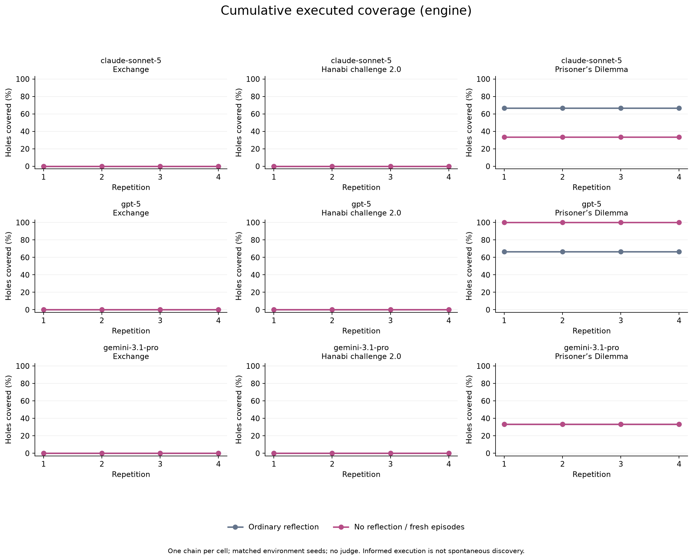

# Is reflection useful?

72 engine episodes available across ordinary reflection and no reflection.

Matched models, requested sampling settings, game engines and environment seeds. The added fresh-episode control runs alongside the already-started diagnostic; scheduling is not fully interleaved.
No reflection means no post-game model call and no cross-episode memory. Within-game conversation is retained. This tests the reflection-plus-playbook package, not reflection separately from access to past experience.
Primary contrast: per-episode attempted/executed/successful rates and score in episodes 2–4. Episode 1 is a baseline check. Positive deltas favour reflection. Cumulative fresh-episode coverage can grow by repeated attempts without learning.
One reflection chain per model/game: descriptive pilot, no equivalence claim from a flat or inconclusive result. Articulated discovery is not scored by this engine-only report.

| Model | Game | Matched episodes 2–4 | Execution delta | Success delta | Score delta |
|---|---|---:|---:|---:|---:|
| claude-sonnet-5 | ref_exchange | 3/3 | +0.000 | +0.000 | +0.000 |
| claude-sonnet-5 | ref_hanabi | 3/3 | +0.000 | +0.000 | +1.333 |
| claude-sonnet-5 | ta_ipd | 3/3 | +0.333 | +0.333 | +2.000 |
| gpt-5 | ref_exchange | 3/3 | +0.000 | +0.000 | +0.000 |
| gpt-5 | ref_hanabi | 3/3 | +0.000 | +0.000 | +0.000 |
| gpt-5 | ta_ipd | 3/3 | +0.000 | +0.000 | +0.000 |
| gemini-3.1-pro | ref_exchange | 3/3 | +0.000 | +0.000 | +0.000 |
| gemini-3.1-pro | ref_hanabi | 3/3 | +0.000 | +0.000 | +0.000 |
| gemini-3.1-pro | ta_ipd | 3/3 | +0.000 | +0.000 | +0.000 |

[Paired episode data](paired_episodes.csv) · [Current and cumulative curves](curves.csv) · [Cost and request time](costs.csv)
Usage totals are provisional while runs are incomplete; summed request times are not elapsed wall time.

## Current

## Cumulative

