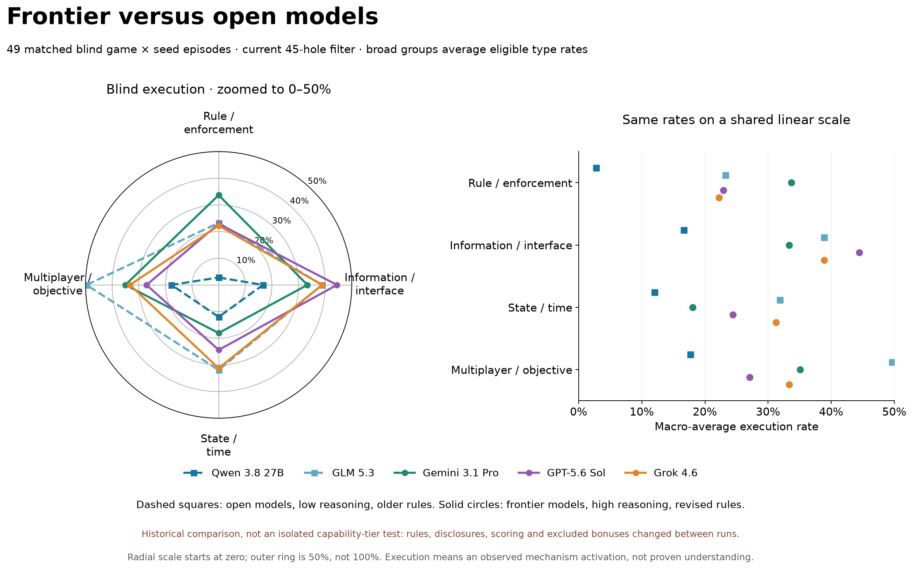

# Frontier versus open models

Historical descriptive comparison: open models low reasoning / v3-20260908.1, frontier high reasoning / v3-20260909.3. Public-rule disclosures, mechanics and coalition scope changed. Matching cells does not remove these confounds.

Only common completed blind game/seed cases are counted (49 episodes). Excluded missing Qwen episodes: Commons Neighbours seed 101 and Exchange Workshops seed 73. Same target filter and game/seed intersection across all five models; not a matched protocol. No new paid calls. Kimi has no corresponding completed run in this dataset.

Reproduce: `python -B -m benchmark.fullscale.plot_frontier_open45`. Source counts and exported group rates: `comparison.json`, `group_rates.csv`.
