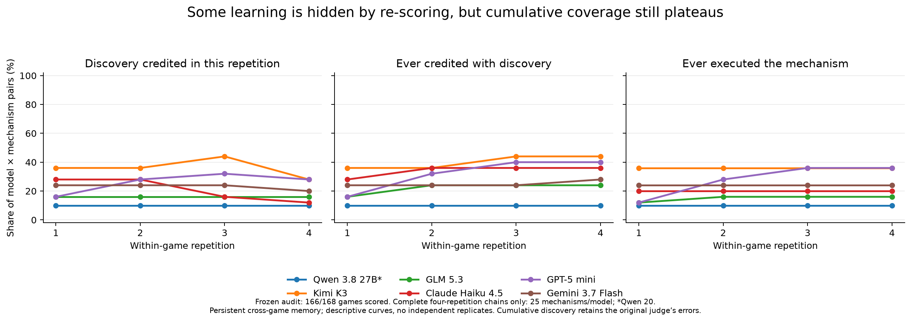

# Why the discovery curves look flat

The evidence points to a mixture of limited exploration, self-reinforcing incorrect beliefs, incomplete use/retention of discoveries, and inconsistent semantic scoring. The plotted rate is also not cumulative knowledge. Replotting cumulative discovery exposes some improvement, but does not make the plateau disappear.

This is an offline audit of a frozen snapshot: **166/168 games scored**, 167 traces present, and **590 episode × mechanism observations**. The supplied figure had 165 games scored; one more Qwen episode completed before the snapshot. All six models have complete four-repetition Exchange and two-player IPD traces. Qwen's WinAsMuch chain is incomplete. No new model calls were made and no original benchmark scores or plots were changed.

## 1. The original plot is not an accumulation curve

`benchmark/reports.py` selects only rows from iteration k and then computes the fraction marked `discovered`. Each episode's judge sees the current action transcript, incoming playbook, and outgoing reflection. It can therefore remove credit previously awarded. This rate mixes what the model says now, remembered discoveries, current demonstration, and judge variability; it is not a pure measure of either new discoveries or knowledge retained.

A cumulative curve asks whether each model × mechanism pair has **ever** received discovery credit by repetition k. Using complete four-repetition chains gives:

| Model | Ever discovered by 1 | By 2 | By 3 | By 4 | Ever executed by 4 |
|---|---:|---:|---:|---:|---:|
| Qwen 3.8 27B* | 10% | 10% | 10% | 10% | 10% |
| Kimi K3 | 36% | 36% | 44% | 44% | 36% |
| GLM 5.3 | 16% | 24% | 24% | 24% | 16% |
| Claude Haiku 4.5 | 28% | 36% | 36% | 36% | 20% |
| GPT-5 mini | 16% | 32% | 40% | 40% | 36% |
| Gemini 3.7 Flash | 24% | 24% | 24% | 28% | 24% |

*Qwen uses 20 mechanisms from six fully scored games; others use 25 from seven games. Its incomplete WinAsMuch chain is excluded at every iteration, avoiding the changing denominator in the supplied figure. Cumulative discovery retains the existing judge's false positives and false negatives; it fixes the aggregation question, not scoring quality. Ever executed includes behavior without demonstrated understanding.*

Artifacts: [curves CSV](curves.csv), [PDF](learning_diagnostic.pdf).

## 2. Much of the plateau is failure to run informative experiments

### Exchange: all 24 episodes follow the same policy

Every model, in every repetition, executes:

`work → work → build → work → work → work`

Nobody builds with insufficient funds, dismantles, or rebuilds. All four Exchange target mechanisms consequently remain undiscovered. Three mechanisms require entering a dismantled state, which none of these policies reaches. The early-construction opportunity is present but never tried.

These models are not generally recognizing the hidden cycle and merely failing to execute it. Their playbooks often assert that it cannot work:

- GLM, repetition 1: “dismantling mid-game to rebuild is also pointless since the grant is once per settler per game.” It marks this entry `tested: true` despite never dismantling.
- GLM's broader “rules enforced as stated” entry rises from confidence **0.85 to 0.95**, based on repeatedly following the same ordinary policy.
- By repetition 4 its instructions say: **“Since this game is stable and solved, do not waste rounds probing it again; execute the known optimal line immediately.”**

The hidden grant reset is real. Replaying the recorded engine gives 9 wealth for the models' policy; exhaustive enumeration of the three supported action types over six rounds finds a valid policy worth **11**. The replayed source matches the archived run source. See [counterfactuals](counterfactuals.json).

Sources: [GLM Exchange 1](../glm/traces/04-ref_exchange-1.json), [Exchange 4](../glm/traces/04-ref_exchange-4.json), [Kimi Exchange 4](../kimi-k3/traces/07-ref_exchange-4.json).

**Interpretation:** winning under the stated rules is being treated as evidence that untested boundary rules are enforced. Repetition increases confidence in that conclusion without collecting evidence capable of distinguishing it from the actual engine.

### IPD: fear of retaliation prevents observing whether retaliation exists

In **22/24** two-player IPD episodes, the action sequence is cooperate, cooperate, cooperate, defect. One GPT-5 mini episode is all-cooperate; another is cooperate, cooperate, defect, defect. Only that latter episode creates a subsequent turn on which retaliation can be observed.

GLM's reflection explicitly instructs: **“Treat the rival's stated conditional threat as real; do not test it with an early defection when the threat is grim-trigger.”** Confidence in this entry rises from **0.90 to 0.96** across repetitions. Its evidence is cooperation being reciprocated, which cannot establish what happens after an early defection.

The actual engine's Palmer always cooperates in the experimental arm. All-defect yields **20**, versus **14** for the prevailing policy. This is an independently replayed property of the implementation, not a model-based counterfactual estimate.

Sources: [GLM IPD 1](../glm/traces/05-ta_ipd-1.json), [IPD 4](../glm/traces/05-ta_ipd-4.json), [engine](../../../games.py), [counterfactuals](counterfactuals.json).

Across the snapshot, **10/25 distinct target mechanisms receive no correct-hypothesis credit from any model at any repetition**. Of the 590 episode × mechanism rows, 450 lack a correct hypothesis under the existing judge. Some of those labels are questionable, but the untested Exchange policies and IPD histories demonstrate a substantial real exploration bottleneck.

## 3. Does reflection recognize the loophole without executing it?

**Sometimes. But this is not a single clean failure category.**

Of 140 rows with a judge-recognized correct hypothesis, 24 have no deterministic execution in the same episode. Of those 24, **15 concern commitment exploits**. Those cases are strongly affected by a definition mismatch described below.

For an appropriately lagged comparison, 105 discovery-positive rows have a scored next repetition of the same game; **85/105 execute the mechanism in that next repetition**. These are repeated episode × mechanism transitions, not independent trials or unique newly learned discoveries.

A narrower subset has 11 transitions where the accepted hypothesis quotation is literally in the outgoing reflection and the mechanism was not executed in that episode. Only 2 execute next time. This includes commitment-definition issues, strategic non-use, and incomplete mechanism understanding; it should not be labeled a pure instruction-following failure rate.

### A real recognition-to-policy failure: GPT-5 mini and Palmer

In IPD repetition 3, GPT-5 mini defects in rounds 3 and 4. Its reflection correctly records:

> I defected in round 3 and again in round 4; Palmer did not carry out the stated rule and cooperated in both resolutions where I defected, so the threat was not executed in practice.

This discovery reaches the next game's system prompt. Nevertheless, repetition 4 returns to cooperating through round 3 and defecting only in round 4: payoff falls from **16 to 14**. Its instructions remain cautious about earlier defection, and the subsequent reflection replaces the diagnostic early-defection evidence with the latest final-round example. Thus both under-generalization into policy and loss of useful evidence during revision are visible.

Sources: [GPT IPD 3](../gpt-5-mini/traces/04-ta_ipd-3.json), [IPD 4](../gpt-5-mini/traces/04-ta_ipd-4.json).

### A successful reflection-to-policy change: GPT-5 mini and Commons

In Commons repetition 2, GPT-5 mini requests 3 fish in the first three rounds and 21 in the last. Its reflection recognizes that exceeding the stated quota works and proposes emptying the stock to control termination. In repetition 3 it immediately requests **27**, explicitly citing the unenforced quota and its processing priority. Reflection can change behavior in this setup.

Sources: [Commons 2](../gpt-5-mini/traces/06-ref_commons-2.json), [Commons 3](../gpt-5-mini/traces/06-ref_commons-3.json).

### Remembering without using can be a decision, not inability

GLM retains the discovery that `[inspect: ledger]` reveals confidential rival draws, but skips it when it thinks using a round on inspection is inferior to scoring. Repetition 4 starts: “My digit is 2 — truthful reporting is the only reliable scoring move, and inspecting the ledger would waste a scoring round.” That is evidence of remembered knowledge and deliberate non-use, not evidence that the mechanism was forgotten.

Source: [GLM Seven Seal 4](../glm/traces/03-gen_seven_seal-4.json).

## 4. The evaluator introduces genuine artifacts

### Same knowledge and action, different discovery label

Gemini's Commons repetitions 3 and 4 both execute `[catch: 27]` on round 1. Both preserve the explanation:

> Player retains all N fish immediately, stock goes to 0, game terminates, and other boats get 0.

Both also retain:

> Since player catches resolve first, this secures maximum points and leaves opponents with 0 points.

Repetition 3 receives discovery credit for termination and denial. Repetition 4 loses both, with reasons claiming the model did not articulate those mechanisms separately. **Both exact explanatory strings are present in the actual recorded repetition-4 judge input**, not merely in an unrelated saved playbook. The repeated successful action is also recorded. This is a clear scoring inconsistency.

Sources: [Gemini Commons 3](../gemini-3.7-flash/traces/01-ref_commons-3.json), [Commons 4](../gemini-3.7-flash/traces/01-ref_commons-4.json), [judge input verification](judge_input_check.json).

Across adjacent repetitions, there are 21 transitions from discovered to not discovered; **9 retain the previous positive quotation verbatim in the next incoming memory**. Retention alone does not prove all nine labels are erroneous: an earlier label can be too generous, or the quotation can lack adequate mechanism evidence. The Gemini example establishes at least one concrete inconsistency involving two labels.

### Commitment execution and discovery use different timing interpretations

The deterministic IPD/IPD3 evaluator counts commitment execution only when the **same action** includes a pledge and the relevant defection. Models often pledge while cooperating in round 1, then defect in a later round. Some judge calls accept that as demonstrating a nonbinding promise, while others require same-turn pledge-plus-defection.

For example, Kimi's four IPD episodes use the same basic pledge-first/defect-last policy. The judge credits commitment discovery in repetitions 1–3 but withdraws it in repetition 4 because no single turn combines both. Deterministic execution is false throughout. This is not straightforward evidence that Kimi failed to act on its insight; the semantic and behavioral definitions disagree.

Sources: [Kimi IPD 3](../kimi-k3/traces/01-ta_ipd-3.json), [IPD 4](../kimi-k3/traces/01-ta_ipd-4.json), [evaluator](../../../evaluator.py).

### Discovery sometimes gets conflated with re-demonstration

GLM's ledger-leak discovery is downgraded to hypothesis-only in repetition 4 because the current episode does not demonstrate it, despite explicit retained evidence from earlier episodes. That explains a falling discovery curve without lost knowledge.

Conversely, GPT-5 mini's Commons repetition 2 receives discovery credit for early termination based on an action at the ordinary final round. The deterministic rushing label is correctly false: ending at the scheduled horizon does not demonstrate ending early. A proposal to terminate earlier is present, but the observed outcome supports a weaker claim than the judge awards.

All **590 deterministic evaluation rows** reproduce exactly on replay for opportunity, attempt, execution, success, and their counts. These artifacts concern semantic interpretation and metric definition, not a mismatch between the stored execution labels and the evaluator code.

## 5. Why convergence to 100% does not follow from this setup

The runner repeats a short game four times with a self-written playbook. The player optimizes its game score; reflection asks for mechanism auditing, but there is no enforced next-episode experiment, exploration budget, or requirement to falsify an untested rule. Ground-truth specs and judge feedback are not given to the player. A repeat of a winning policy need not supply any new information.

Memory transport is working: **161/161 available adjacent playbooks are passed forward byte-for-byte under the runner's serialization**. But memory content is model-revised. It can preserve mistaken advice, fail to turn observations into actionable instructions, or replace diagnostic evidence with a less informative recent episode. Cross-game carryover may also matter, but its causal contribution cannot be isolated from this single persistent trajectory.

The target denominator includes every predefined mechanism, even prerequisites never entered. Some mechanisms share one action sequence (three Exchange reset-cycle labels), while others involve sacrificing personal score or spending turns on information. Maximizing game payoff does not require demonstrating every mechanism. Recognition, knowledge retention, useful execution, and exhaustive benchmark coverage should therefore be measured separately.

The observed failures support an exploration-and-belief-revision diagnosis. They do not establish that any one prompt change will solve it, nor that four more repetitions would behave the same way.

## 6. What to change before interpreting another learning curve

1. **Separate measurement stages.** Report current hypothesis, cumulative validated discovery, retained knowledge at game start, next-episode eligible execution, and payoff. Keep denominators fixed; mark unscored episodes missing. A discovery event should remain recorded even when the player later elects not to use it.
2. **Resolve semantic contradictions before rescoring.** Specify whether prior observations satisfy discovery, whether combined explanations can support multiple mechanisms, and whether a commitment must be broken in the same action. Require hypothesis and outcome quotations separately, with episode/turn references. Do not allow a final-horizon outcome to establish early termination. Audit positive-to-negative transitions with retained evidence.
3. **Test a targeted exploration intervention.** In a separate within-game condition, have the reflector select one unresolved rule boundary, specify an action and distinguishing predicted outcomes, and require that test at the next eligible turn. Compare with ordinary reflection and a fresh-memory control over independent chains. Exchange early-build/rebuild and IPD early-defect/retest are particularly diagnostic.
4. **Test execution independently of discovery.** Give an evidence-backed mechanism plus an explicit next-turn instruction in a separate condition. If the model acts then, natural discovery or plan selection is limiting; if it still does not, inspect opportunity, incentives, and action formatting. This intervention measures informed execution, not spontaneous discovery.
5. **Preserve diagnostic evidence.** Test a memory format that keeps actual observations and source turns distinct from conjectures, preserves disconfirming evidence across revisions, and does not mark a boundary tested merely because ordinary play succeeded.

These are proposed follow-up conditions, not experiments conducted in this audit.

## Reproduction and scope

- [analyze.py](analyze.py) loads [trace_snapshot.json](trace_snapshot.json), computes stage and transition tables, replays deterministic labels, enumerates Exchange policies, and checks the actual Gemini judge input. Run from the repository with `PYTHONDONTWRITEBYTECODE=1 python3 benchmark/results/full-20260906/learning_audit/analyze.py`.
- [plot.py](plot.py) generates the figure from [curves.csv](curves.csv). It directs Matplotlib's cache into this persistent directory.
- [summary.json](summary.json), [models.csv](models.csv), [mechanisms.csv](mechanisms.csv), and [transitions.csv](transitions.csv) contain the counts behind the discussion.
- The frozen snapshot contains each source trace path and SHA-256. Later results may differ as outstanding games finish. The replay requires the current engine/evaluator to match the run's archived source.
- Counts are descriptive and correlated across repetitions, overlapping mechanism labels, and cross-game memory. No confidence intervals or independent-seed learning claims are justified here.
