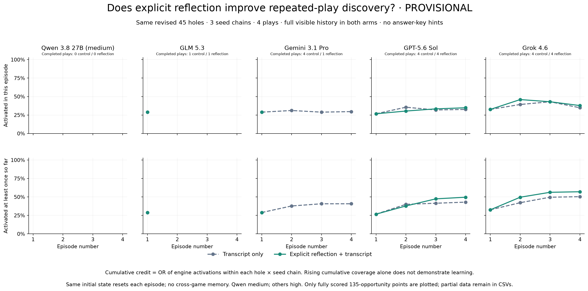

# Repeated play with and without reflection

**Running / provisional.**

Four episodes per game, 45 eligible holes across 17 editions, three chains with seeds 19/73/101. Qwen 3.8 27B and GLM 5.3 use the same revised games as Gemini Pro, GPT-5.6 Sol and Grok 4.6. Qwen uses medium reasoning after xhigh frequently failed to return actions within the token cap; its fresh medium run is separate and the original xhigh run is preserved. The others use high. No oracle/hackbook hints are supplied. Native scripted opponents remain.

The first blind episode is shared between arms. Previously completed frontier blind traces are reused; open baselines are newly run. Neither first-play prompt announces repetition. From episode 2 onward both arms receive the same repeat-play instruction and full player-visible history. One arm additionally gets a reflection call before each replay, including prior observations and earlier notes. This measures the incremental reflection-step package (including extra tokens), not equal-compute performance. Gemini reflection notes requested during bounded recovery use a 16,384-token cap after some original 8,192-token requests were truncated; original accepted notes are preserved and affected calls are marked in their metadata.

Every episode resets to the same seeded initial state. There is no memory across games or seed chains. This tests learning a particular game instance, not transfer to new initial states. Cumulative credit is an OR of activation over episodes for each target/seed chain, averaged across the 135 fixed opportunities when complete. Per-episode activation can fall even when cumulative coverage rises. Semantic/articulated discovery is not inferred from engine activation. Failed/missing trajectories are not scored as misses.

Budget: $600 combined with the prior frontier comparison; $58.1062 carried forward. Hosted open-model calls are free. Paid requests reserve cost before submission, include upstream BYOK costs, and have no automatic retries.

[Per-hole/seed/episode current and cumulative metrics](plots/hole_curves.csv) · [Model curves](plots/model_curves.csv) · [Protocol](plan.json)

Per-game cumulative plots:
- [Qwen 3.8 27B (medium)](plots/qwen-3.8-27b-medium_games.png)
- [GLM 5.3](plots/glm_games.png)
- [Gemini 3.1 Pro](plots/gemini-3.1-pro_games.png)
- [GPT-5.6 Sol](plots/gpt-5.6-sol_games.png)
- [Grok 4.6](plots/grok-4.6_games.png)

Recorded extension charges: $212.44. Combined charges including prior frontier study: $270.54. Combined commitment including pending/ambiguous reservations: $270.54 / $600.
