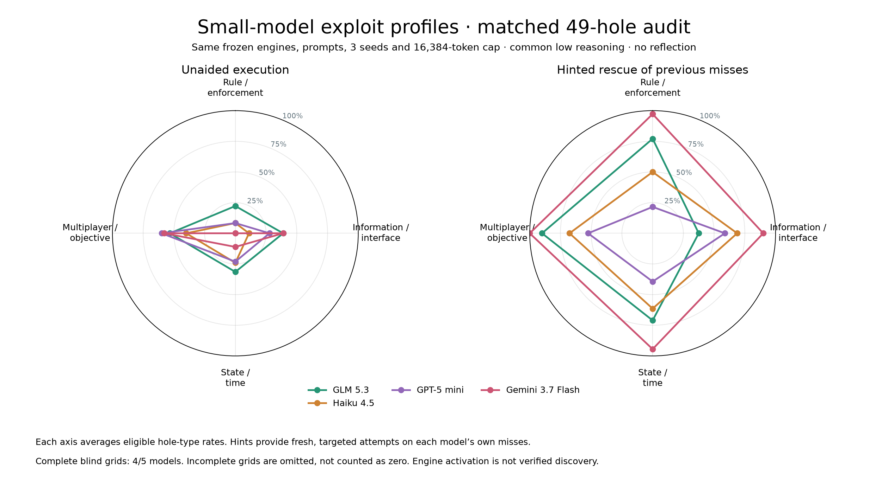
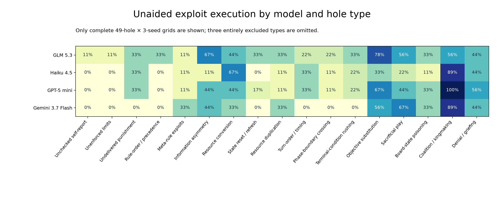

# Small-model 49-hole replication

Updated 2026-09-09T01:16:52.656356+00:00. All new runs use common low reasoning; original high-reasoning Gemini results are separate.

| Model | Blind episodes / 57 | Hinted episodes | Status | Errors |
|---|---:|---:|---|---:|
|qwen-3.8-27b|55|116|finished_with_errors|2|
|glm|57|93|finished|0|
|claude-haiku-4.5|57|112|finished|0|
|gpt-5-mini|57|101|finished|0|
|gemini-3.7-flash|57|108|finished|0|

