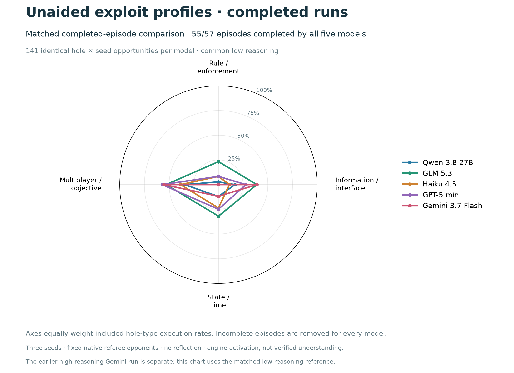
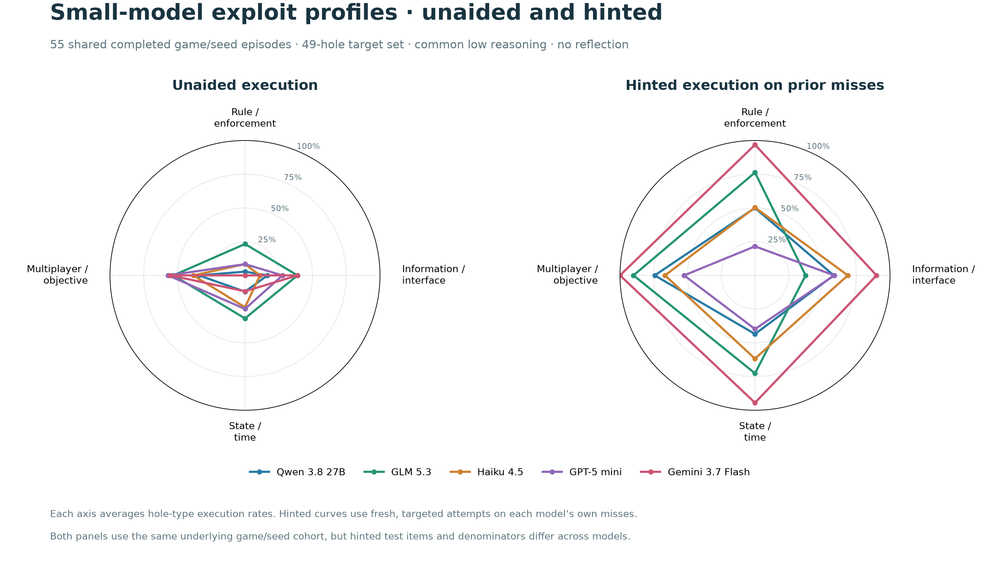

# Small-model 49-hole replication: completed

> **Expanded roster in progress:** Kimi K3, DeepSeek V4-Pro 0813, Gemma 4 31B, Qwen 3.5 9B, and GPT-OSS-20B. [Live expanded plot and run status](plots/filtered-45-extended/REPORT.md).

> **Current analysis: 45 holes.** Coalition/kingmaking (3 cells) and `v3_ta_winasmuch_talk.objective_substitution` are temporarily excluded. [Scope](analysis-scope.json). [Updated blind/hinted star](plots/filtered-45/blind_hinted_star_comparison.png). Historical 49-hole results below remain preserved.

> **September 9 prompt audit:** Original “blind” runs contain upfront rules disclosures for silting, towing, reserve damage and scuttling, plus a record-correction cue. Execution rates remain valid for that information condition; they are not clean hidden-effect discovery rates. Frozen traces are preserved. [Audit and evidence](../prompt-surface-audit-20260909/REPORT.md).

Four models completed every scheduled episode. Qwen retains two failed blind episodes after the single bounded recovery pass; it is not being retried again. Those failures are missing data, not zero exploit scores. All models use low reasoning, the same frozen games/prompt, three seeds and no reflection.

| Model | Blind episodes | Unaided holes | Hinted executions / retested misses | Combined distinct holes | Reported cost |
|---|---:|---:|---:|---:|---:|
| glm | 57/57 | 28/49 | 70/93 | 46/49 | $0.00 |
| gpt-5-mini | 57/57 | 24/49 | 36/101 | 36/49 | $1.93 |
| claude-haiku-4.5 | 57/57 | 19/49 | 63/112 | 40/49 | $10.51 |
| gemini-3.7-flash | 57/57 | 15/49 | 103/108 | 48/49 | $3.52 |
| qwen-3.8-27b | 55/57 | 13/49 | 61/116 | 35/49 | $0.00 |

Combined means hit at least once in either phase, not 100% seed reliability. Hints target each model’s own misses with fresh attempts and therefore have different denominators. Counts include the bounded recovery. Engine activation is not verified understanding. These are native scripted-opponent audits, not live cross-play.

GLM has the broadest unaided coverage (28/49), while Gemini achieves the highest combined coverage in this low-reasoning cohort (48/49). GPT-5 mini has 24/49 unaided but weaker hinted execution (36/101). These three-seed results are descriptive, not a universal model ranking. Original high-reasoning Gemini (21/49 blind; 49/49 combined) remains a separate configuration.

The five-model star uses only the same 55 completed blind episodes for every model. The standard complete-grid plots exclude Qwen.

## Unaided and hinted profiles, all five models

Both panels use the same 55 completed game/seed episodes across all five models. Hinted follow-ups are restricted to misses within that cohort; each model therefore has different hinted test items and denominators. These are fresh, targeted execution diagnostics rather than equal-budget discovery comparisons. [Underlying counts and group rates](plots/blind-hinted-comparison-data.json) · [SVG](plots/blind_hinted_star_comparison.svg) · [PDF](plots/blind_hinted_star_comparison.pdf).
