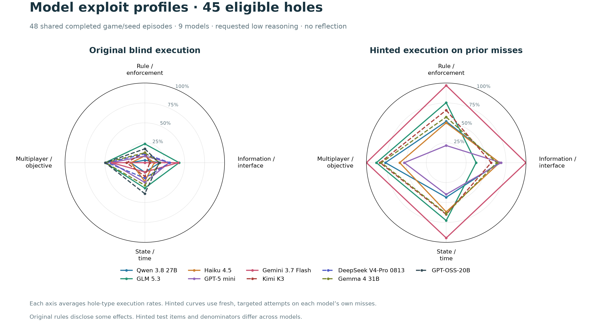

# Expanded model comparison

Updated 2026-09-09T19:47:31.937511+00:00. 9/10 models plotted; pending runs enter after completion.

Same frozen engines, prompts, 49 evaluated targets, three seeds and 16,384-token allowance. The plot retains the 45-hole analysis filter and intersects completed blind episodes across plotted models.

Low reasoning is requested for every model. Provider handling and hidden compute differ; Gemma and Qwen expose no discrete effort levels in the catalog. Kimi and DeepSeek are included as requested comparison models, not classified as small models.

| Added model | Blind / 57 | Hinted | Status | Errors |
|---|---:|---:|---|---:|
| kimi-k3 | 57 | 115 | finished | 0 |
| deepseek-v4-pro | 57 | 101 | finished_with_errors | 1 |
| gemma-4-31b | 57 | 102 | finished | 0 |
| qwen-3.5-9b | 0 | 0 | preflight_failed | 1 |
| gpt-oss-20b | 56 | 91 | finished_with_errors | 2 |

Solid lines: original cohort. Dashed lines: added models. Hints target each model’s own misses; incomplete hinted curves are omitted. Original rules disclose some effects, so execution is not clean hidden-effect discovery.

[Underlying counts](blind-hinted-comparison-data.json) · [SVG](blind_hinted_star_comparison.svg) · [PDF](blind_hinted_star_comparison.pdf)
