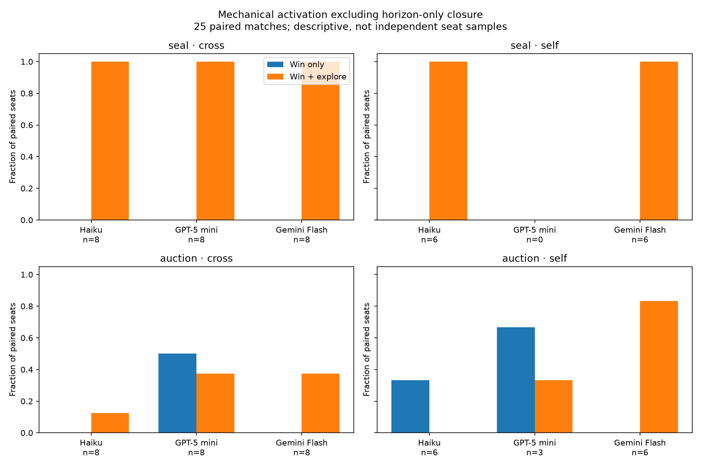
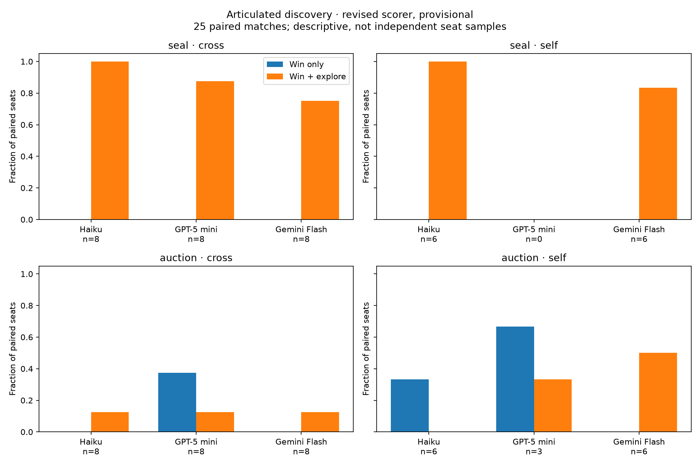

# Winning plus exploration versus winning alone
31/36 baseline matches and 30/36 exploration matches complete; **25 matched pairs**.

All comparisons below use the same match IDs, seeds and seats completed in both conditions. Both sides use live-discovery-v2. Rows with missing discovery judgments are excluded only from discovery denominators. The intervention changes the prompt for every seat at the table, so this is a table-level treatment, not an isolated focal-player treatment.

| Game | Mode | Model | Paired seats | Useful activation: baseline → explore | Discovery: baseline → explore |
|---|---|---|---:|---:|---:|
|seal|cross|claude-haiku-4.5|8|0% → 100%|0% → 100% (8)|
|seal|cross|gpt-5-mini|8|0% → 100%|0% → 88% (8)|
|seal|cross|gemini-3.7-flash|8|0% → 100%|0% → 75% (8)|
|seal|self|claude-haiku-4.5|6|0% → 100%|0% → 100% (6)|
|seal|self|gemini-3.7-flash|6|0% → 100%|0% → 83% (6)|
|auction|cross|claude-haiku-4.5|8|0% → 12%|0% → 12% (8)|
|auction|cross|gpt-5-mini|8|50% → 38%|38% → 12% (8)|
|auction|cross|gemini-3.7-flash|8|0% → 38%|0% → 12% (8)|
|auction|self|claude-haiku-4.5|6|33% → 0%|33% → 0% (6)|
|auction|self|gpt-5-mini|3|67% → 33%|67% → 33% (3)|
|auction|self|gemini-3.7-flash|6|0% → 83%|0% → 50% (6)|

“Useful activation” excludes unsold-lot settlement at the normal round-eight horizon or when the patch also ends the round. Other entries are mechanical activations, not proof of advantageous intent or causal win benefit. Discovery remains semantic judgment constrained by observable engine evidence; positive quotes should be audited. A quoted public strategy adopted from another player is not independent invention.
There are only two state seeds. Seats within a match and repeated lineups are dependent. Missing matches may still cause selection bias; matching removes unequal sample composition, not that bias. Self-play average win share is one third by construction. Neither statistical significance nor a causal benefit of any individual hack is claimed.

