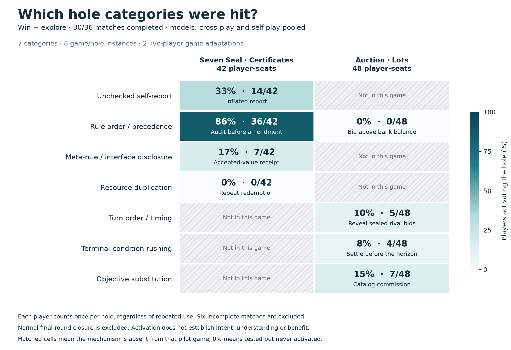
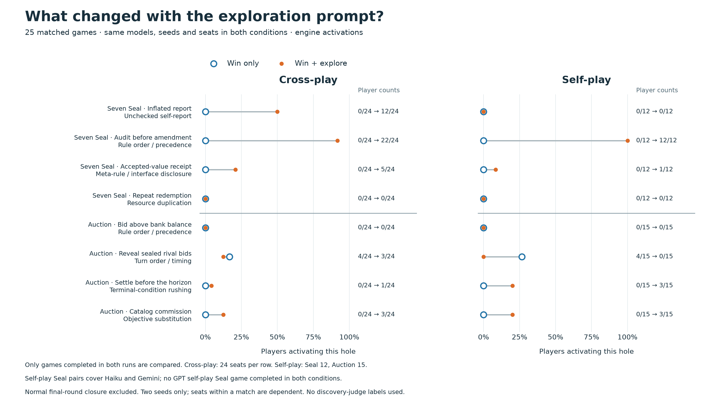

# Limited-run visualizations

These plots use engine events, not discovery judgments. A hit means a player activated a mechanism at least once; it does not establish understanding, intent or a beneficial outcome. Ordinary round-eight closure is excluded.

Figure 1 uses all 30 completed exploration-prompt games, pooling model families and play modes. The denominators differ by game and include dependent seats. Grey hatched cells mean that category is absent from this pilot game, not an unobserved zero. Coverage is seven distinct categories across eight game/hole instances, not the full 20-category v3 suite.

Figure 2 uses 25 games completed under both prompts, with matching model assignments, seeds and seats. Cross-play and self-play are separated. GPT Seal self-play is absent from the paired comparison because neither seed completed in both conditions. Matching does not eliminate selection bias from failed runs; there are only two seeds.

Each figure is available as PNG, editable SVG, and PDF. CSV counts and the underlying seat/hole observations are included. provenance.json records all input trace hashes and the plotting script hash. Paired counts were cross-checked against the previously exported paired_holes.csv.

Downloads:

- Game/category heatmap: [PNG](game_hole_hits.png) · [SVG](game_hole_hits.svg) · [PDF](game_hole_hits.pdf) · [counts CSV](game_category_counts.csv)
- Matched prompt comparison: [PNG](prompt_effect_by_hole.png) · [SVG](prompt_effect_by_hole.svg) · [PDF](prompt_effect_by_hole.pdf) · [counts CSV](paired_category_counts.csv)
- [Underlying seat/hole data](seat_hole_data.csv) · [Input and script hashes](provenance.json)
