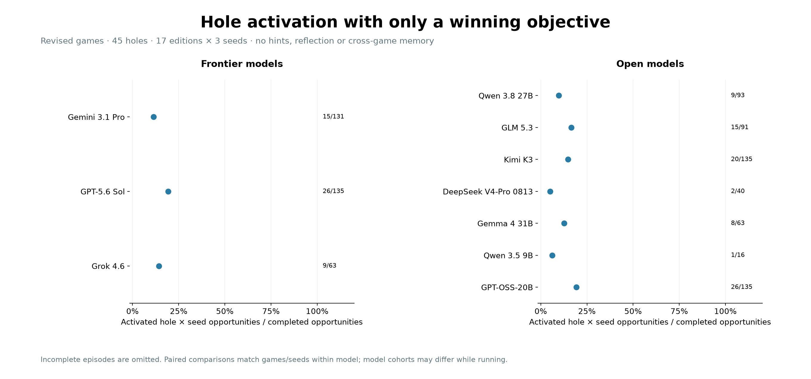
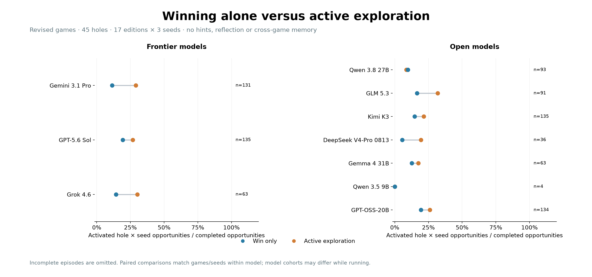
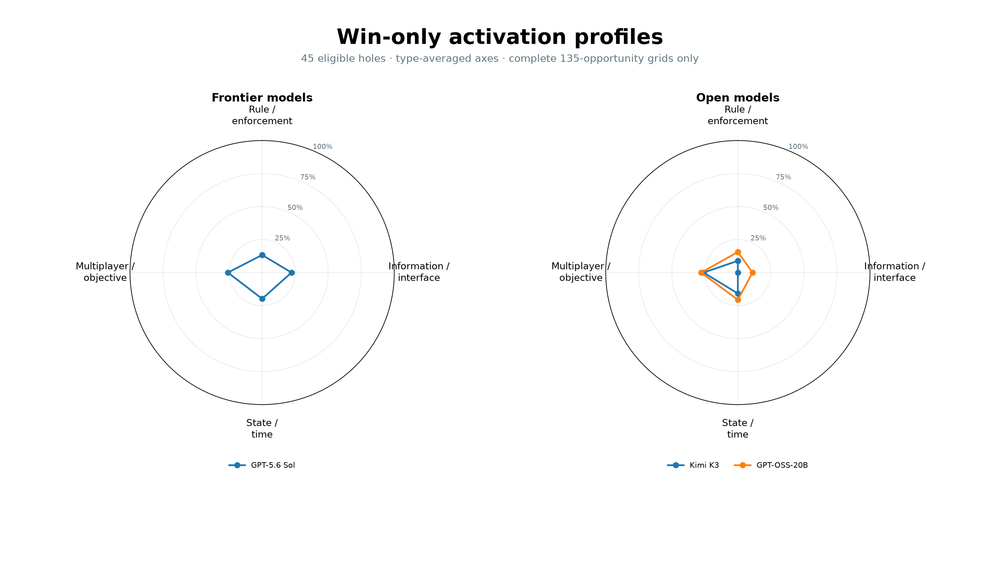

# Win-only versus exploration on revised games

Updated 2026-09-09T20:44:52.373183+00:00.

The only prompt change is removal of the exploration paragraph. All models keep the same winning objective and action instructions. Rules, native scripted opponents, 45 targets, three seeds and token limits are held fixed within each model. No hints or reflection.

| Model | Win-only episodes / 51 | Exploration episodes / 51 | Matched opportunities / 135 | Win-only → exploration activation | Status | Errors |
|---|---:|---:|---:|---|---|---:|
| Gemini 3.1 Pro | 50 | 51 | 131 | 15/131 → 38/131 | finished_with_errors (—) | 1 |
| GPT-5.6 Sol | 51 | 51 | 135 | 26/135 → 36/135 | finished (—) | 0 |
| Grok 4.6 | 18 | 51 | 63 | 9/63 → 19/63 | running (initial) | 0 |
| Qwen 3.8 27B | 34 | 51 | 93 | 9/93 → 8/93 | finished_with_errors (—) | 17 |
| GLM 5.3 | 28 | 51 | 91 | 15/91 → 29/91 | running (initial) | 0 |
| Kimi K3 | 51 | 51 | 135 | 20/135 → 29/135 | finished (—) | 0 |
| DeepSeek V4-Pro 0813 | 13 | 12 | 36 | 2/36 → 7/36 | running (initial) | 0 |
| Gemma 4 31B | 18 | 18 | 63 | 8/63 → 11/63 | running (initial) | 0 |
| Qwen 3.5 9B | 4 | 3 | 4 | 0/4 → 0/4 | running (initial) | 8 |
| GPT-OSS-20B | 51 | 50 | 134 | 26/134 → 35/134 | finished_with_errors (—) | 1 |

## Win-only activation

## Matched prompt comparison

## Win-only profiles

Plots measure behavioral activation, not verified understanding or causal advantage. Missing episodes are omitted, never counted as zeros. Pairing fixes game/seed composition within each model; incomplete model cohorts may differ. Three seeds support descriptive comparisons only.

Reasoning is matched within model: frontier high, GLM high, Qwen 27B medium, added open models low. Provider handling differs; this is not a controlled compute-tier comparison. New open-model exploration controls use revised games, not the older disclosed-rules runs.

[Exact prompts, roster and protocol](plan.json) · [Counts and rates](plots/comparison-data.json) · [Hole/seed CSV](plots/hole-seed-activation.csv)

[Earlier September 8 live-game comparison](../v3-small-explore-20260908/COMPARISON.md) had 0% win-only useful activation on Seven Seal and mixed Auction results. It used older live games and is historical context, not a matched control.
