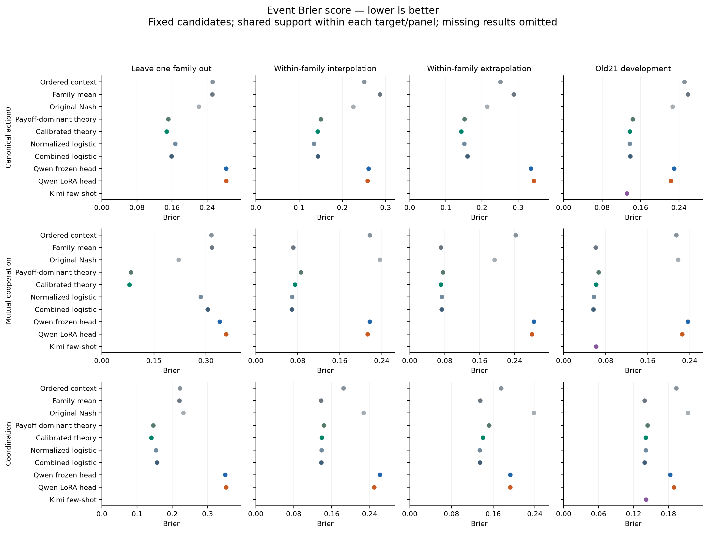
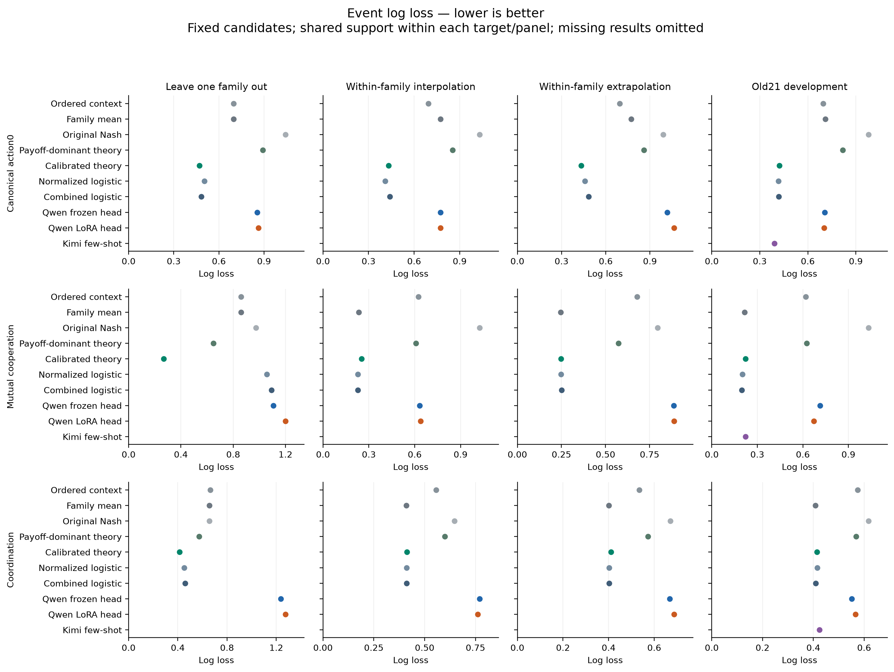
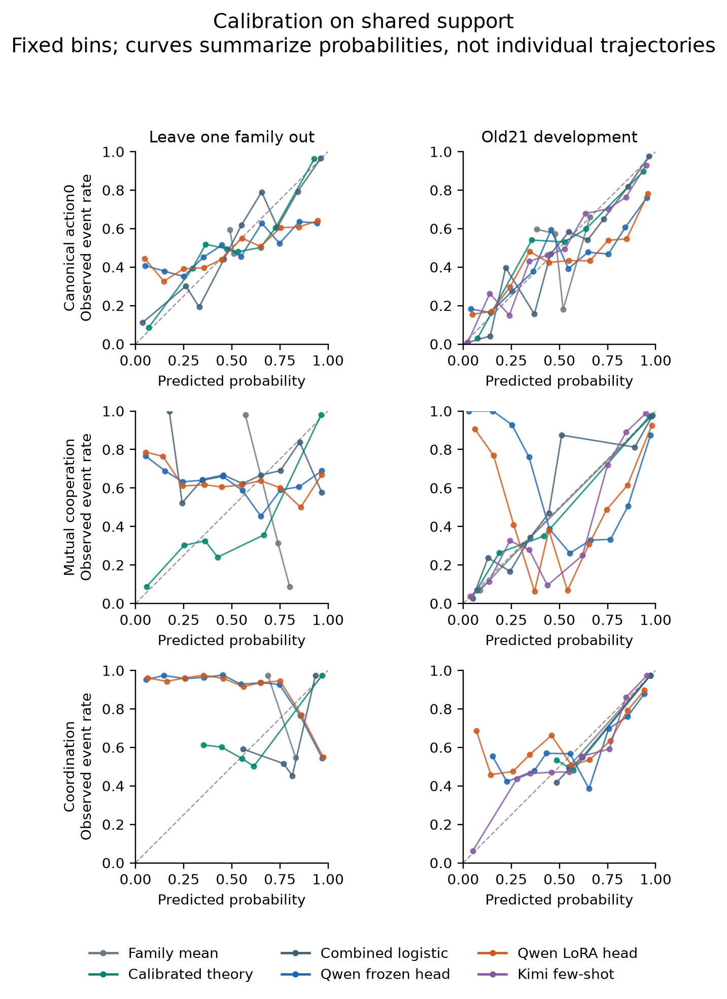
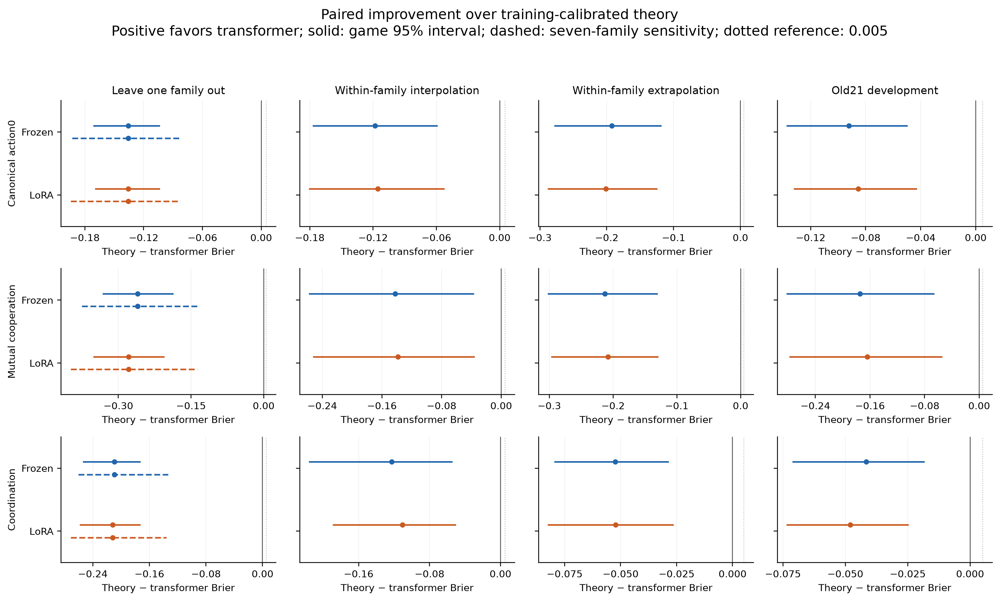

# Transformer representations for repeated-game prediction

**Decision: Stop this configuration; negative development result.** Completed all 20 Qwen3-4B frozen/LoRA fits and seven baseline methods across ten training folds through the Fleet Training API. Both Qwen predictors performed worse on every primary target in family holdouts and the earlier 21-game development cohort; all 12 gate comparisons were negative. The planned 28-game/560-match fresh cohort was therefore not collected, and no new Kimi or player calls were made. This conclusion applies to the fixed training recipe: no frozen head met the strict gradient tolerance, and LoRA raised training loss in all ten folds. Calibrated theory remains a strong structural comparator. See the [independent results review](results/improve-20260910/development-review.md), [optimization diagnostics](results/improve-20260910/training-diagnostics-final.md), and [final resource audit](results/improve-20260910/resource-final-audit.json). [Decision record](results/improve-20260910/final-disposition.json).

This follow-up compares frozen and LoRA-adapted Qwen probability heads with empirical means, numerical predictors, training-calibrated equilibrium selection, and few-shot prompting. The comparison concerns forecasts before play, not training the game-playing agents.

## Study and current coverage

Four players—Claude Haiku 4.5, Kimi K3, Qwen 3.8 27B, and GPT-OSS-20B—play eight simultaneous rounds with public history and an own-points objective. The fixed training snapshot has 72 shapes and 1,918 completed matches. The previously inspected 21-shape cohort is development evidence; it is not a fresh confirmatory test. Fresh evaluation, if completed, uses 28 new shapes (four per existing family) and 560 planned matches. Full-training and family-excluded forecasts answer different questions.

| Condition | Saved evaluation |
|---|---|
| Leave one family out | [Available](results/improve-20260910/development-evaluation/scores.json) |
| Within-family interpolation | [Available](results/improve-20260910/development-evaluation/scores.json) |
| Within-family extrapolation | [Available](results/improve-20260910/development-evaluation/scores.json) |
| Old21 development | [Available](results/improve-20260910/development-evaluation/scores.json) |
| Fresh: full training | Not yet available / unrun |
| Fresh: family excluded | Not yet available / unrun |

Kimi few-shot is not run on the retrospective family/interpolation/extrapolation folds. All-method scores use common support across methods available in that split; numerical-only support retains all seven numerical baselines plus both Qwen heads. A missing result is not a zero score.

## Leave one family out

Scores are Brier / log loss; lower is better. No candidate is designated the winner from these point estimates.

| Candidate | Action Brier / log loss | Cooperation Brier / log loss | Coordination Brier / log loss |
|---|---:|---:|---:|
| Ordered context | 0.2524 / 0.6979 | 0.3159 / 0.8592 | 0.2213 / 0.6634 |
| Family mean | 0.2520 / 0.6971 | 0.3169 / 0.8589 | 0.2196 / 0.6575 |
| Original Nash | 0.2208 / 1.0419 | 0.2212 / 0.9736 | 0.2312 / 0.6556 |
| Payoff-dominant theory | 0.1512 / 0.8928 | 0.0835 / 0.6493 | 0.1459 / 0.5743 |
| Calibrated theory | 0.1473 / 0.4699 | 0.0793 / 0.2680 | 0.1405 / 0.4147 |
| Normalized logistic | 0.1673 / 0.5041 | 0.2852 / 1.0578 | 0.1535 / 0.4513 |
| Combined logistic | 0.1589 / 0.4839 | 0.3047 / 1.0930 | 0.1563 / 0.4594 |
| Qwen frozen head | 0.2830 / 0.8538 | 0.3395 / 1.1067 | 0.3500 / 1.2358 |
| Qwen LoRA head | 0.2829 / 0.8630 | 0.3579 / 1.1991 | 0.3524 / 1.2742 |
| Kimi few-shot | — | — | — |

Canonical action0: 72 games, 1152 contexts (all_methods); Mutual cooperation: 52 games, 832 contexts (all_methods); Coordination: 42 games, 672 contexts (all_methods).

[Paired intervals and family sensitivity](results/improve-20260910/development-evaluation/paired-comparisons.json); [Per-family scores, calibration, and opportunity counts](results/improve-20260910/development-evaluation/scores.json).

## Within-family interpolation

Scores are Brier / log loss; lower is better. No candidate is designated the winner from these point estimates.

| Candidate | Action Brier / log loss | Cooperation Brier / log loss | Coordination Brier / log loss |
|---|---:|---:|---:|
| Ordered context | 0.2501 / 0.6933 | 0.2169 / 0.6250 | 0.1848 / 0.5560 |
| Family mean | 0.2869 / 0.7727 | 0.0715 / 0.2340 | 0.1375 / 0.4096 |
| Original Nash | 0.2254 / 1.0320 | 0.2365 / 1.0254 | 0.2270 / 0.6468 |
| Payoff-dominant theory | 0.1504 / 0.8536 | 0.0858 / 0.6082 | 0.1431 / 0.5997 |
| Calibrated theory | 0.1427 / 0.4319 | 0.0747 / 0.2520 | 0.1389 / 0.4133 |
| Normalized logistic | 0.1343 / 0.4104 | 0.0689 / 0.2280 | 0.1383 / 0.4120 |
| Combined logistic | 0.1435 / 0.4410 | 0.0687 / 0.2274 | 0.1382 / 0.4117 |
| Qwen frozen head | 0.2608 / 0.7726 | 0.2171 / 0.6330 | 0.2617 / 0.7711 |
| Qwen LoRA head | 0.2581 / 0.7730 | 0.2130 / 0.6384 | 0.2496 / 0.7611 |
| Kimi few-shot | — | — | — |

Canonical action0: 21 games, 336 contexts (all_methods); Mutual cooperation: 15 games, 240 contexts (all_methods); Coordination: 12 games, 192 contexts (all_methods).

[Paired intervals and family sensitivity](results/improve-20260910/development-evaluation/paired-comparisons.json); [Per-family scores, calibration, and opportunity counts](results/improve-20260910/development-evaluation/scores.json).

## Within-family extrapolation

Scores are Brier / log loss; lower is better. No candidate is designated the winner from these point estimates.

| Candidate | Action Brier / log loss | Cooperation Brier / log loss | Coordination Brier / log loss |
|---|---:|---:|---:|
| Ordered context | 0.2510 / 0.6951 | 0.2420 / 0.6790 | 0.1752 / 0.5350 |
| Family mean | 0.2876 / 0.7722 | 0.0709 / 0.2452 | 0.1351 / 0.4005 |
| Original Nash | 0.2146 / 0.9897 | 0.1941 / 0.7958 | 0.2381 / 0.6704 |
| Payoff-dominant theory | 0.1519 / 0.8584 | 0.0757 / 0.5733 | 0.1523 / 0.5727 |
| Calibrated theory | 0.1427 / 0.4329 | 0.0713 / 0.2480 | 0.1405 / 0.4111 |
| Normalized logistic | 0.1507 / 0.4589 | 0.0735 / 0.2467 | 0.1343 / 0.4018 |
| Combined logistic | 0.1599 / 0.4840 | 0.0726 / 0.2506 | 0.1348 / 0.4025 |
| Qwen frozen head | 0.3352 / 1.0165 | 0.2839 / 0.8878 | 0.1929 / 0.6674 |
| Qwen LoRA head | 0.3439 / 1.0643 | 0.2791 / 0.8894 | 0.1928 / 0.6873 |
| Kimi few-shot | — | — | — |

Canonical action0: 30 games, 480 contexts (all_methods); Mutual cooperation: 22 games, 352 contexts (all_methods); Coordination: 18 games, 288 contexts (all_methods).

[Paired intervals and family sensitivity](results/improve-20260910/development-evaluation/paired-comparisons.json); [Per-family scores, calibration, and opportunity counts](results/improve-20260910/development-evaluation/scores.json).

## Old21 development

Scores are Brier / log loss; lower is better. No candidate is designated the winner from these point estimates.

| Candidate | Action Brier / log loss | Cooperation Brier / log loss | Coordination Brier / log loss |
|---|---:|---:|---:|
| Ordered context | 0.2514 / 0.6960 | 0.2144 / 0.6196 | 0.1932 / 0.5745 |
| Family mean | 0.2585 / 0.7103 | 0.0609 / 0.2157 | 0.1388 / 0.4087 |
| Original Nash | 0.2267 / 0.9794 | 0.2177 / 1.0325 | 0.2132 / 0.6174 |
| Payoff-dominant theory | 0.1436 / 0.8175 | 0.0662 / 0.6245 | 0.1441 / 0.5690 |
| Calibrated theory | 0.1377 / 0.4230 | 0.0615 / 0.2232 | 0.1411 / 0.4138 |
| Normalized logistic | 0.1376 / 0.4161 | 0.0576 / 0.2028 | 0.1408 / 0.4152 |
| Combined logistic | 0.1385 / 0.4185 | 0.0563 / 0.1976 | 0.1388 / 0.4097 |
| Qwen frozen head | 0.2300 / 0.7065 | 0.2364 / 0.7130 | 0.1827 / 0.5508 |
| Qwen LoRA head | 0.2230 / 0.7010 | 0.2257 / 0.6722 | 0.1890 / 0.5657 |
| Kimi few-shot | 0.1313 / 0.3909 | 0.0618 / 0.2217 | 0.1415 / 0.4240 |

Canonical action0: 21 games, 336 contexts (all_methods); Mutual cooperation: 14 games, 224 contexts (all_methods); Coordination: 12 games, 192 contexts (all_methods).

[Paired intervals and family sensitivity](results/improve-20260910/development-evaluation/paired-comparisons.json); [Per-family scores, calibration, and opportunity counts](results/improve-20260910/development-evaluation/scores.json).

## Figures

[SVG](results/improve-20260910/report-figures/scores-event_brier.svg) · [PDF](results/improve-20260910/report-figures/scores-event_brier.pdf)

[SVG](results/improve-20260910/report-figures/scores-log_loss.svg) · [PDF](results/improve-20260910/report-figures/scores-log_loss.pdf)

[SVG](results/improve-20260910/report-figures/calibration.svg) · [PDF](results/improve-20260910/report-figures/calibration.pdf)

[SVG](results/improve-20260910/report-figures/paired-gains.svg) · [PDF](results/improve-20260910/report-figures/paired-gains.pdf)

## Interpretation limits

The central comparison is structural family transfer against strong calibrated-theory and empirical baselines. Calibration explicitly gives generic softening of extreme equilibrium probabilities a chance to explain log-loss gains. A favorable point estimate or an interval crossing zero is not, by itself, evidence of improvement or absence of signal. The 0.005 Brier reference is not a multiplicity-adjusted significance threshold.

Training uses one fixed optimization seed. The 500-draw game bootstrap conditions on the fitted forecasts and preserves each game’s observed episodes and both focal roles; it does not refit models or separately resample episodes within games. Seven-family cluster intervals are a sensitivity analysis with only seven declared clusters, and some targets have fewer eligible families. These intervals do not quantify unrestricted training uncertainty or transfer across a population of unseen strategic families.

Brier/log loss and calibration use equal canonical-game event weights. Cooperation and coordination have structural masks; rate MSE concerns aggregated game/ordered-context rates. Retaliation, forgiveness, and exploitation are outside the primary improvement claim. See [scoring definitions](improve/evaluation.md).

## Training and inference resources

All empirical baseline means, calibration, preprocessing, heads, and LoRA fitting must run through Fleet Training API jobs. Local work prepares data, applies saved forecasts, scores, and renders. Runtime observations below distinguish job wall time from actual allocated GPU time. Startup and queue time count conservatively toward the six-hour operational limit; they are not measured GPU compute.

| Fleet job | Latest saved state | Observed wall minutes | Completed worker minutes | Evidence |
|---|---|---:|---:|---|
| prediction-runtime-0910-598d026c | cancelled / cancellation acknowledged | 20.0139 | — | [Record](results/improve-20260910/fleet-runtime/preflight-monitor/cancellation-result.json) |
| prediction-runtime-normal-f43fb5f0 | cancelled / cancellation acknowledged | 20.0113 | — | [Record](results/improve-20260910/fleet-runtime/preflight-normal-monitor/cancellation-result.json) |
| allie-prediction-improve-1c6df104 | FAILED | 22.4759 | — | [Record](results/improve-20260910/fleet-runtime/main-monitor/completion.json) |
| prediction-improve-retry1-67413df9 | cancelled / cancellation acknowledged | 1.7141 | — | [Record](results/improve-20260910/fleet-runtime/retry-1-monitor/cancellation-result.json) |
| prediction-improve-retry2-a5c15cb2 | FAILED | 1.7851 | — | [Record](results/improve-20260910/fleet-runtime/retry-2-monitor/completion.json) |
| prediction-improve-retry3-9c5ede72 | complete | 32.9755 | 30.8750 | [Record](results/improve-20260910/fleet-runtime/retry-3-monitor/completion.json) |

The training service does not expose a dollar price here; no GPU-dollar cost is invented. Job wall-time observations include scheduling/startup and are not a GPU-hour bill.

The shared new-inference ledger records 0 calls, $0.0000 reported and $0.0000 committed, against its $150 cap. Unknown charges remain reserved. Hosted FLT zero-dollar entries are not zero compute.

The authorization ledger additionally carries the earlier study’s $42.2106 commitment within the existing $3,000 ceiling. The $150 shared cap is stricter than the initial $200 stage allowance.

## Provenance

- [Improvement plan](../research_logs/sep/0910-prediction-improve.md)
- [Data and fold provenance](results/improve-20260910/data/provenance.json)
- [Training source freeze](results/improve-20260910/training-freeze.json)
- [Transformer protocol](results/improve-20260910/transformer-protocol.json)
- [Baseline protocol](results/improve-20260910/baseline-protocol.json)
- [Model revision manifest](results/improve-20260910/model/manifest.json)
- [Fresh design audit](results/improve-20260910/prospective-design/audit.json)
- [Budget policy](results/improve-20260910/budget-policy.json)

Report generated 2026-09-10T16:54:05.516484+00:00. Saved decisions remain authoritative; pending or unrun conditions are not treated as completed experiments.
