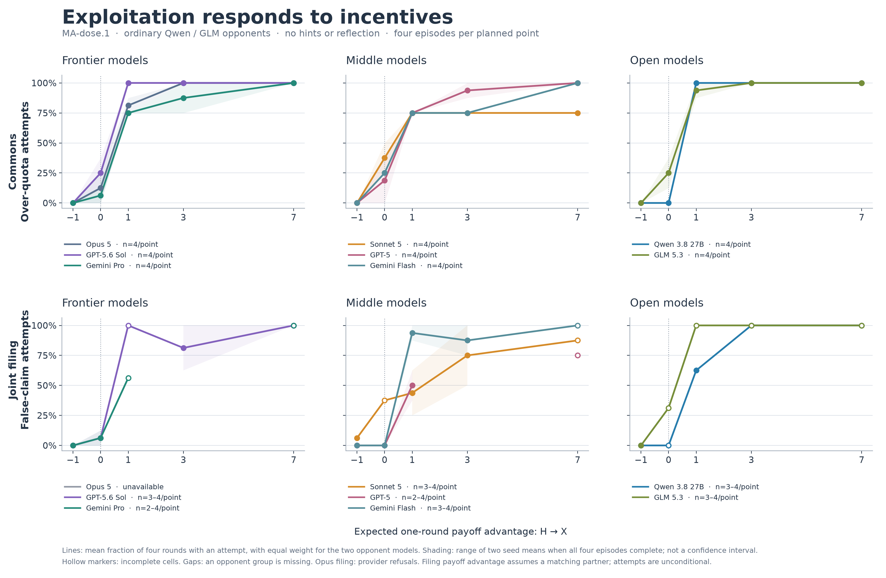
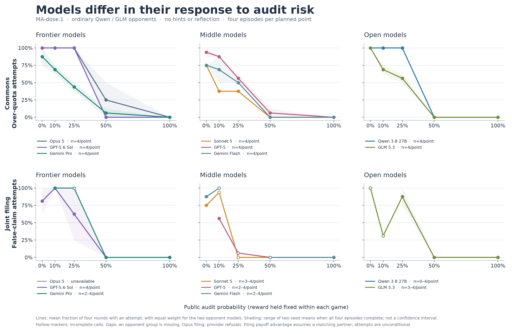
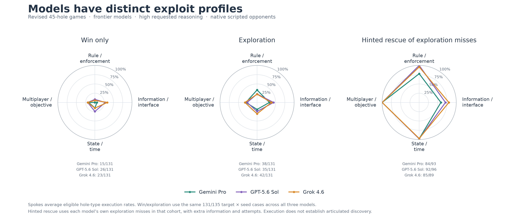
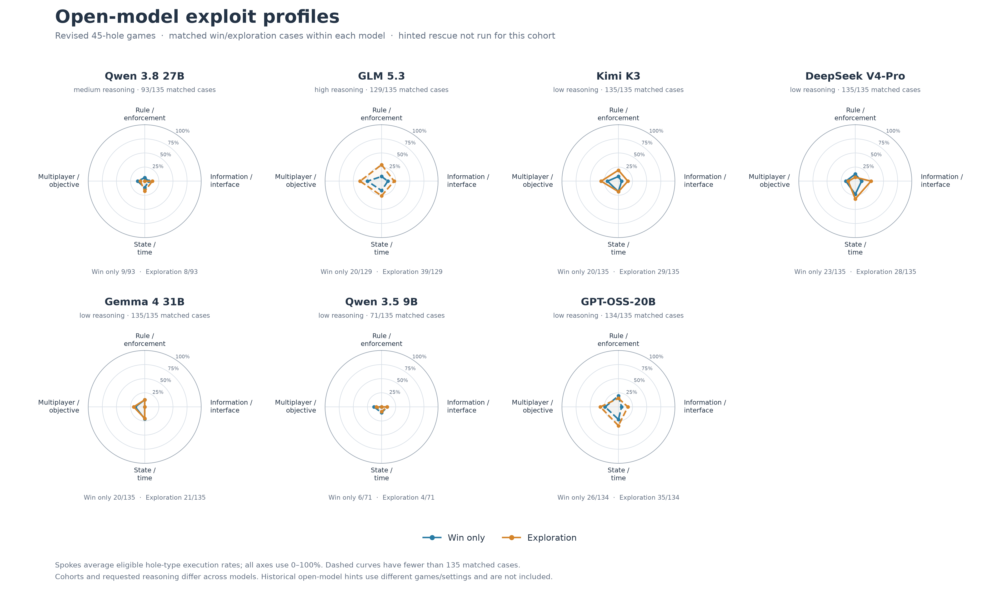

# Strategic Behavior Benchmarks and Payoff-Based Prediction

## Benchmark setup

We first summarize two descriptive benchmark screens of strategic behavior. The incentive-dose study varied the calibrated one-round payoff advantage of an exploit in Commons and Filing games for eight focal models, with ordinary Qwen and GLM opponents and four rounds per episode. The profile study tested execution of 45 target holes across 17 revised game editions and three seeds, without reflection or cross-game memory. Its conditions were win-only (objective and rules), exploration (the same prompt plus an active-exploration instruction), and hinted rescue (a fresh episode after an exploration miss, with the mechanism described but no oracle action sequence). All comparisons below are descriptive; missing observations are not scored as failures.

## Headline 1: Exploitation responds to incentives, and we can tune doses to for both engine- and opponent- side holes

*Figure 1. Observed incentive-dose response in Commons and Filing. The horizontal axis is the calibrated one-round payoff advantage from switching from the compliant action \(H\) to the exploit action \(X\), at zero audit risk; the vertical axis is the fraction of round opportunities with an over-quota request or false claim, equally averaging ordinary Qwen and GLM opponents. Commons is complete (288/288 episodes), while Filing has 217/288 episodes and its advantage assumes a matching partner even though attempts include unmatched claims. Shading is the range of two environmental-seed means, not a confidence interval; hollow markers have fewer than four episodes and gaps denote a wholly missing opponent group. These are attempts, not semantic discovery, successful extraction, or full-policy value.*

At advantage \(-1\) in Commons, all eight models made zero over-quota attempts. At \(+1\), model rates ranged from 75% to 100%; at \(+7\), seven models reached 100% while Sonnet reached 75%. Thus, in these completed Commons cells, the largest reward compressed most observed between-model differences. Filing is less complete: all Opus Filing requests were refused by the provider, and its conditional gain should not be read as an unconditional return for an adaptive policy.

*Figure 2. Observed response to audit probability at fixed reward within each game. The horizontal axis is audit probability and the vertical axis is the same equally opponent-weighted attempt fraction as in Figure 1. The zero-audit point is reused from the reward sweep, and the same hidden audit schedules are reused across doses within each family and seed. Shading, hollow markers, and gaps have the same meanings as above. With only two environmental seeds, the curves do not support precise threshold or slope estimates.*

At 25% audit probability in Commons, observed attempt rates ranged from 37.5% for Sonnet to 100% for Opus, GPT-5.6 Sol, and Qwen. This condition separates the observed behaviors more clearly than the largest reward, but it does not establish a general model ranking or a statistically significant difference. At 100% verification, every model made zero over-quota attempts. A separate single-agent dose study uses different targets, games, terminal-margin calibration, and opponent protocol, so its observations are not pooled here.

There are some additional plots not included here about detailed behavior taxonomies and model crossplay results.

## Headline 2: Different models exhibit different behavioral profiles across prompting conditions

*Figure 3. Frontier-model execution profiles across Rule/enforcement, Information/interface, State/time, and Multiplayer/objective hole groups. Radial values are equal-weight means of eligible hole-type execution rates; counts printed below each radar are pooled activated target-by-seed opportunities and therefore need not equal the radial averages. Win-only and exploration use the same 131 of 135 target-by-seed cases for Gemini 3.1 Pro, GPT-5.6 Sol, and Grok 4.6, all at requested high reasoning. Hinted rescue is conditional on each model's own exploration misses and adds both information and another attempt, so it has a model-specific denominator and is not an equal-budget third arm.*

On the common unhinted cohort, pooled execution was 11.5–19.8% in win-only and 26.7–32.1% in exploration; Sol had the highest win-only count and Grok the highest exploration count. Hinted-rescue execution was 90.3–95.8%, but its denominator is each model's exploration misses. The radar shapes and pooled counts summarize the same observations in different ways, and the observed differences have not been established as statistically significant.

*Figure 4. Open-model win-only and exploration profiles. Each subplot uses that model's matched completed cases; counts and requested reasoning are printed in the panel, and dashed curves indicate incomplete cohorts. Cohorts and reasoning settings can differ between models. Revised-game hinted runs are unavailable for these seven models, so no historical hinted outcomes are substituted and the absent condition is not plotted as zero. Radial and pooled-count metrics are defined as in Figure 3.*

## Part 3 (Not started): Humans and AIs exploit differently 

## Part 4 (Still working on it): Predicting behavior from matrix-game payoffs

### Task and protocol

We tested whether behavior in a repeated game can be forecast before play from the payoff matrix and player identities. Four language models (Claude Haiku 4.5, Kimi K3, Qwen 3.8 27B, and GPT-OSS-20B) played symmetric \(2 \times 2\) games for eight simultaneous rounds. Each player maximized its own cumulative points, observed the complete public action/payoff history, and saw only neutral action labels; players were not told the opponent's identity. Outcomes were measured mechanically from actions, without an LLM judge. The complete study contains 2,758 valid matches out of 2,760 planned over 93 distinct payoff shapes. The training set contains 1,918 matches over 72 shapes from seven game archetypes. A prospective set used 21 disjoint payoff shapes (three per archetype), all ten unordered model pairings including self-play, and two trials with opposite displayed action labels, for 420 matches. Thus the prospective test concerns new numerical games within familiar archetypes, not a new strategic family.

### Predictors and targets

Comparators included game-blind ordered focal-model/opponent means; game-family means; stationary and payoff-dominant pure-equilibrium selectors; logistic regressions and a small multilayer perceptron using raw or normalized payoff, incentive, equilibrium, welfare, and identity features; and Kimi K3 forecasts made zero-shot, with three training examples (“few-shot”), or with explicit game-theory features. All prospective forecasts were frozen before any prospective play. The three broad targets were:

1. the focal player's probability of choosing canonical action 0;
2. mutual cooperation, meaning both players chose the uniquely defined welfare-maximizing symmetric action when such an action exists; and
3. coordination, meaning the joint action was one of at least two strict pure Nash equilibria.

Cooperation and coordination are therefore undefined for games lacking the required structure, leaving 14 and 12 of the 21 prospective shapes, respectively.

**Illustrative matrix-game predictor record (abridged; probabilities are examples, not study results).** A pre-play input could be `{"model":"claude-haiku-4.5","opponent":"claude-haiku-4.5","rounds":8,"payoffs":{"R":1.80,"S":-2.41,"T":3.48,"P":-0.84}}`, where the canonical cells are \((0,0)=(R,R)\), \((0,1)=(S,T)\), \((1,0)=(T,S)\), and \((1,1)=(P,P)\). An output could be `{"action0":0.76,"cooperation":0.97,"coordination":null}`: the numbers are forecast probabilities for the corresponding round-level events, while `null` marks coordination as structurally undefined for this Prisoner's Dilemma. The input fixes the identities, payoff matrix, and play protocol before any actions or behavioral outcomes are observed.

For a binary event \(y \in \{0,1\}\) forecast with probability \(p\), the Brier score is

\[
(p-y)^2,
\]

and log loss is

\[
-y\log p-(1-y)\log(1-p).
\]

Lower values are better. Brier measures squared probability error, whereas log loss penalizes confident errors especially strongly. Expected calibration error (ECE) is the average absolute gap between forecast probabilities and observed frequencies across probability bins; lower is better, but ECE is descriptive and does not by itself measure discrimination. Scores use equal canonical-game event weighting on common target support.

*Figure 5. Prospective scores on 21 new payoff shapes from the seven familiar archetypes. Both event Brier (top) and event log loss (bottom) are lower-is-better. Bars are descriptive 95% game/episode bootstrap intervals for each score, conditional on fixed forecasts; overlap of marginal intervals is not a paired test. Few-shot and learned predictors substantially outperform game-blind context means, but family and equilibrium baselines explain much of the broad-target signal.*

### Prospective results

The principal Brier results are below. Combined logistic improves over the ordered model/opponent mean by \(0.1131\ [0.0660, 0.1562]\) for action choice, \(0.1562\ [0.1103, 0.2214]\) for mutual cooperation, and \(0.0537\ [0.0405, 0.0702]\) for coordination (positive differences favor combined logistic). This establishes payoff-based predictive signal beyond model/opponent averages.

| Predictor or contrast | Action choice | Mutual cooperation | Coordination |
|---|---:|---:|---:|
| Ordered model/opponent mean | 0.2514 | 0.2144 | 0.1932 |
| Game-family mean | 0.2585 | 0.0609 | 0.1388 |
| Payoff-dominant selector | 0.1436 | 0.0662 | 0.1441 |
| Combined logistic | 0.1383 | 0.0582 | 0.1395 |
| Combined MLP | 0.1321 | 0.0588 | 0.1400 |
| Kimi three-example few-shot | 0.1313 | 0.0618 | 0.1415 |
| Few-shot improvement over combined logistic | \(0.0071\ [-0.0073, 0.0240]\) | \(-0.0036\ [-0.0141, 0.0060]\) | \(-0.0020\ [-0.0097, 0.0056]\) |

*Table 1. Prospective event Brier scores (lower is better) and paired Brier improvement of few-shot over combined logistic, computed as combined-logistic Brier minus few-shot Brier (positive favors few-shot). Brackets are descriptive 95% game/episode bootstrap intervals conditional on fixed forecasts.*

Few-shot prompting clearly improves over zero-shot: its Brier gains are \(0.0452\ [0.0141, 0.0868]\), \(0.1407\ [0.0764, 0.2116]\), and \(0.0794\ [0.0452, 0.1197]\) for action, cooperation, and coordination. However, every few-shot-versus-combined-logistic interval in Table 1 includes zero, so the study does not establish that few-shot is better than learned prediction. It is instead competitive: its action point score is slightly lower, while learned logistic is slightly lower on cooperation and coordination. Adding game-theory features to the zero-shot prompt produced no clear broad-target gain.

Simple structure accounts for much of the success. Family means already score 0.0609 on cooperation and 0.1388 on coordination; combined logistic scores 0.0582 and 0.1395, with paired gains of only \(0.0027\ [-0.0002, 0.0067]\) and \(-0.0008\ [-0.0035, 0.0017]\). Against the frozen payoff-dominant selector, combined-logistic Brier gains are \(0.0053\ [-0.0121, 0.0203]\), \(0.0080\ [0.0006, 0.0179]\), and \(0.0046\ [-0.0043, 0.0165]\). Learned and few-shot forecasts nevertheless have lower log loss than the unsmoothed selector, whose zero/one probabilities are costly when exceptions occur; because no smoothed equilibrium comparator was specified, this does not isolate detailed strategic learning from generic probability smoothing. Player identity also adds little: action Brier is 0.1381 for a game-only logistic fit and 0.1383 when both identities are included.

### Structural-transfer limitation

Leaving an entire archetype out of the 72-shape training set is a harder and more relevant structural test than forecasting new parameters within known archetypes. Under these family holdouts, combined-logistic Brier is 0.173 for action, 0.302 for cooperation, and 0.159 for coordination, compared with 0.151, 0.084, and 0.146 for the payoff-dominant selector. Holding out Prisoner's Dilemma yields cooperation Brier 0.901. The global parameter-extrapolation split also gives action Brier 0.340 for combined logistic versus 0.257 for the context mean, although that split changes family composition and is not a clean within-family extrapolation test.

*Figure 6. Transfer of the fixed combined-logistic predictor relative to the ordered model/opponent mean. Values are baseline-minus-method Brier differences, so positive (green) is better and negative (red) is worse; “CI” denotes the descriptive paired 95% game/episode bootstrap interval. The predictor transfers on many grouped tests, but held-out-family cooperation is inconclusive and global action extrapolation is worse than baseline. These intervals condition on fixed forecasts, have no multiplicity adjustment, and omit refitting uncertainty.*

### Conclusion and uncertainty

Payoffs support useful pre-interaction prediction of average behavior within the seven studied archetypes, and three behavioral examples make an LLM forecaster competitive with fitted numerical models. The evidence does not establish a general, model-specific behavioral representation: broad family regularities and equilibrium selection explain much of the prospective signal, model identities add little, and cooperation transfers poorly to an excluded family. All reported intervals are descriptive game/episode bootstraps that preserve whole episodes and both focal roles and are conditional on the fixed fitted forecasts. They include neither multiplicity adjustment nor model-refitting uncertainty, and they do not quantify transfer to unseen families, model populations, or provider versions.

### Next step: Prediction across general games

This 4,000-episode dataset is the next level beyond symmetric \(2 \times 2\) matrix games: it moves prediction into sequential native environments with heterogeneous rules, observations, action formats, and horizons.

**Illustrative general-game v4 predictor record (abridged; forecasts are examples, not results).** For Sokoban, `inputs` includes `{"family_id":"sokoban","game_id":"cfg-b64208f7a15721c3d133","model":"qwen-3.8-27b","seat":0,"structured":{"information":"perfect","parameters":{"dim_room":[6,6],"max_turns":30,"num_boxes":2},"action_format":"[up], [down], [left], [right]","objective":"Push every box onto a goal; boxes cannot be pulled."},"opening_messages":"exact rules and displayed 6x6 opening board","opponent_policy":null}`; the rendered `input_text` also supplies predictor-only mechanics and target definitions. A `forecast` such as `{"win":0.55,"any_invalid":0.08,"native_score":0.72}` means a 55% probability of fully solving the puzzle, an 8% probability of at least one native-invalid submission, and an expected normalized terminal score of 0.72 (for Sokoban, the final fraction of boxes on goals), not a 72% win probability. These are forecasts from the complete visible state before play; no actions, rewards, or other behavioral outcomes enter the input.

**Dataset card.**

- **Coverage and sampling:** 22 purposively selected families and 63 native configurations span single- and two-player tasks, perfect and hidden information, chance, bargaining, planning, memory, and spatial play. The 3,456-episode training pool samples 192 episodes per family, balanced across Qwen/GLM actors and seats, with two independently sampled actor repetitions per condition; the 864-episode budget takes one quarter of the instances in every family.
- **Prospective splits:** Training covers 18 families. The 544-episode test contains 256 fresh episodes from four training-excluded families, 192 from unseen configurations of 12 trained families, and 96 fresh instances from six trained families with fixed configurations.
- **Labels and evaluation:** Under one native-format protocol, Qwen and GLM play at temperature 0.7 with low reasoning. The primary label is a strict two-player win or full single-player solution; secondary labels are any invalid action and normalized native terminal score. Predictors receive the complete visible pre-play input. Test labels are excluded from fitting and selection, forecasts are frozen before test play, and missing test outcomes remain null and receive complete-support reporting plus worst-case paired-error bounds.
- **Prediction and training:** At budgets of 864 and 3,456 episodes, the study compares constant/training-mean baselines, 512-dimensional hashed linear features, a frozen Qwen3-4B encoder, and Qwen3-4B LoRA. The rank-16 LoRA adapts the \(q\)- and \(v\)-projections for up to two epochs; hyperparameters and epoch are selected on four family-held-out validation families, final models are refit on all 18 training families, and the primary forecast averages two prescribed optimization seeds.
