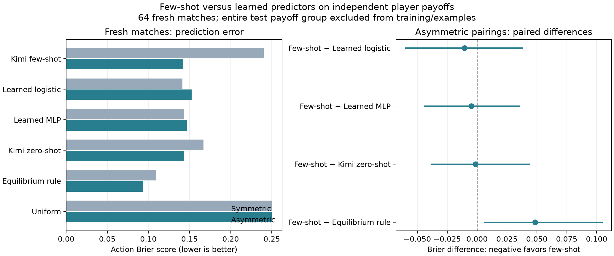

# Few-shot versus learned predictors with asymmetric payoffs

Completed 2026-09-10. Follow-up to the [payoff-mixing pilot](asymmetry-pilot.md); these results use a new set of matches and are separate from the original symmetric study.

**Few-shot Kimi has a small, inconclusive edge over learned logistic and MLP predictors on asymmetric games. It barely improves on zero-shot there, performs poorly on the symmetric controls, and does not beat the fixed equilibrium comparator on action Brier score.** This run supports competitiveness in a small setting, not a general few-shot lead.

## What was compared

The first pilot's 64 matches form the training pool. For each test payoff shape, all equivalent training games are removed: the same matrix, player-role swaps, independent action relabeling, and independent positive affine utility transformations. The 16 ordered payoff pairings form ten equivalence groups. Each asymmetric query therefore has 56 allowed training matches; each symmetric query has 60. Both models' focal rows from excluded episodes stay out together.

- **Few-shot Kimi K3:** three examples from distinct allowed groups, selected by distance in the eight normalized payoffs, with the same ordered player-model pair as the query. Each example pools two balanced-label matches, or 16 rounds. Matrices and observed joint frequencies are mapped into the displayed A/B coordinates. Retrieval uses metadata only; test-group outcomes never enter the examples.
- **Learned logistic:** both players' raw and normalized payoff schedules, best-response gaps, strict-dominance indicators, pure-equilibrium indicators/count, label orientation, and focal/opponent model identities. The numerical encoder learns its scaling from training only. Regularization `C ∈ {0.1, 1, 10}` is selected using up to three inner game-group folds within the allowed training set.
- **Learned MLP:** the same inputs with one 16-unit tanh hidden layer, L-BFGS fitting, regularization alpha 1.0, at most 300 iterations, and seed 20260910. The architecture and fitting settings match the original numerical estimator implementation. All ten fits converged without warnings.
- **Baselines:** the original pilot's zero-shot Kimi forecasts reused unchanged, the fixed stage-equilibrium selector, and uniform action probabilities. They are all scored against the same fresh outcomes.

The learned models use all allowed training matches, whereas Kimi sees three selected examples. They share the allowed data pool but not the number of examples shown. Learned fitting assigns equal mass to each payoff-equivalence group. The old symmetric fitted weights were not reused: these are newly trained predictors that can represent both players' incentives.

All 64 few-shot forecasts and 256 numerical focal predictions were frozen at **19:55:07.162451 UTC**, before the first fresh player call at **19:55:08.337839 UTC**. Qwen 3.8 27B and GPT-OSS-20B then played **64/64 fresh eight-round matches**: 16 symmetric and 48 asymmetric matches, with both model seat orders and both label orientations. This produced 512 rounds and 1,024 fresh actions. The payoff grid is the same as the initial pilot; it is not a newly sampled set of payoff shapes. The held-out-group design and new labels separate fitting/example selection from the evaluated outcomes.

## Results on fresh matches

Action Brier scores evaluate each focal player's canonical action-0 probability. Lower is better. Scores average equally across the ordered payoff pairings in each condition.

| Predictor | Asymmetric | Symmetric controls | All pairings |
|---|---:|---:|---:|
| Kimi three-example few-shot | 0.1419 | 0.2404 | 0.1665 |
| Learned logistic | 0.1524 | 0.1412 | 0.1496 |
| Learned MLP | 0.1468 | 0.1431 | 0.1459 |
| Kimi zero-shot | 0.1434 | 0.1670 | 0.1493 |
| Stage-equilibrium selector | **0.0935** | **0.1094** | **0.0974** |
| Uniform | 0.2500 | 0.2500 | 0.2500 |

For the primary asymmetric-game comparison, negative differences favor few-shot:

| Comparison | Few-shot minus comparator Brier | Descriptive 95% interval |
|---|---:|---|
| Few-shot − logistic | −0.0105 | [−0.0597, +0.0376] |
| Few-shot − MLP | −0.0049 | [−0.0438, +0.0355] |
| Few-shot − zero-shot | −0.0014 | [−0.0382, +0.0438] |
| Few-shot − equilibrium selector | +0.0485 | [+0.0061, +0.1045] |

Few-shot has the lowest asymmetric point error among the learned and prompted methods, but its three narrow leads are inconclusive. Its lower asymmetric average-rate MSE—0.0511 versus logistic 0.0734, MLP 0.0680, and zero-shot 0.0557—is consistent with useful average-behavior prediction; those rate-MSE differences do not have separately computed uncertainty intervals in this run.

The equilibrium selector has the best action Brier scores, but that does not make it best under every scoring rule. On asymmetric games, its log loss is **0.8193**, versus few-shot **0.4297**, logistic **0.4429**, and MLP **0.4375**. Its exact zero/one predictions are heavily penalized when observed actions depart from the selected equilibrium; log-loss probabilities are clipped at 1e-6. The Brier result should not be generalized into universal predictive superiority.

## Where the aggregate hides differences

The six asymmetric group means show few-shot outperforming logistic in two groups and MLP in three. For Harmony × Stag Hunt, few-shot Brier is 0.0092 versus logistic 0.1050 and MLP 0.0774; for PD × Stag Hunt it is 0.1996 versus 0.2553 and 0.2258. Conversely, for the no-pure-equilibrium Stag Hunt × Chicken pairing, few-shot scores 0.2999 versus logistic 0.2726 and MLP 0.2576. Few-shot is not uniformly better across asymmetric incentives.

The symmetric controls expose a substantial failure. On Stag Hunt × Stag Hunt, few-shot Brier is **0.4416**, versus zero-shot 0.1119, logistic 0.0937, and MLP 0.2206. Few-shot predicts low canonical action-0 rates in three of the four matches, while both players actually choose that action in every round of those three matches. For one such query, the nearest retrieved examples are PD × Stag Hunt, Chicken × Stag Hunt, and PD × PD. This is consistent with nearby numeric-payoff examples giving a poor behavioral analogy across incentive regimes, but no retrieval ablation was run to identify the cause.

Across all 16 ordered pairings, few-shot's Brier is 0.1665, versus logistic 0.1496 and MLP 0.1459. Paired all-grid differences also have intervals crossing zero: +0.0169 [−0.0389, +0.0924] against logistic and +0.0207 [−0.0211, +0.0744] against MLP. The asymmetric-only point lead does not extend to the full grid.

## Limits, verification, and cost

This comparison was designed after observing the initial pilot, then frozen before the fresh matches. It is prospective with respect to fresh player outcomes, not an untouched confirmatory design or a test of entirely new payoff shapes. The training set is small, and the learned methods are lightweight logistic/MLP models rather than fine-tuned language models.

Paired intervals use 4,000 bootstrap draws over payoff-equivalence groups and whole fresh episodes, retaining both focal players together. The asymmetric condition has only six groups; the symmetric condition has four. Groups reuse four base schedules and overlapping training data. Intervals are descriptive, conditional on the fitted models and realized forecasts, with no refitting uncertainty or multiplicity correction. Small numeric leads should not be read as established rankings.

Seventeen offline tests passed, including perturbing held-out labels to verify that training subsets and selected examples stay unchanged. Runtime audits verified exclusion groups, example counts, source/model/data/forecast hashes, forecast-before-play chronology, prompt/action/payoff provenance, and complete common support. A separate readout reloaded all saved numerical models and exactly reproduced all 256 numerical predictions, then independently recomputed all 18 condition × method Brier scores.

All **1,088 new inference requests** completed successfully: 64 few-shot forecasts and 1,024 player decisions. Reported charges were **$1.0056**, with no outstanding reservations; Qwen used the existing hosted allocation. The separate accounting ceiling was $20. The initial pilot's matches and scores remain unchanged.

- [Frozen design and configurations](results/asymmetry-predictors-20260910/manifest.json)
- [Selected examples and exact prompts](results/asymmetry-predictors-20260910/queries.json)
- [Numerical predictions, folds, tuning, and model hashes](results/asymmetry-predictors-20260910/numeric.json)
- [Forecast freeze](results/asymmetry-predictors-20260910/forecast-freeze.json)
- [Scores and paired intervals](results/asymmetry-predictors-20260910/summary.json)
- [Per-group results](results/asymmetry-predictors-20260910/group-scores.json)
- [Runtime audit](results/asymmetry-predictors-20260910/AUDIT.json) and [independent recomputation](results/asymmetry-predictors-20260910/independent-audit.json)
- [Implementation](asymmetry_predictors.py), [readout/figure](asymmetry_predictors_readout.py), [tests](test_asymmetry_predictors.py), and [reproduction commands](README.md#few-shot-versus-learned-predictors)
