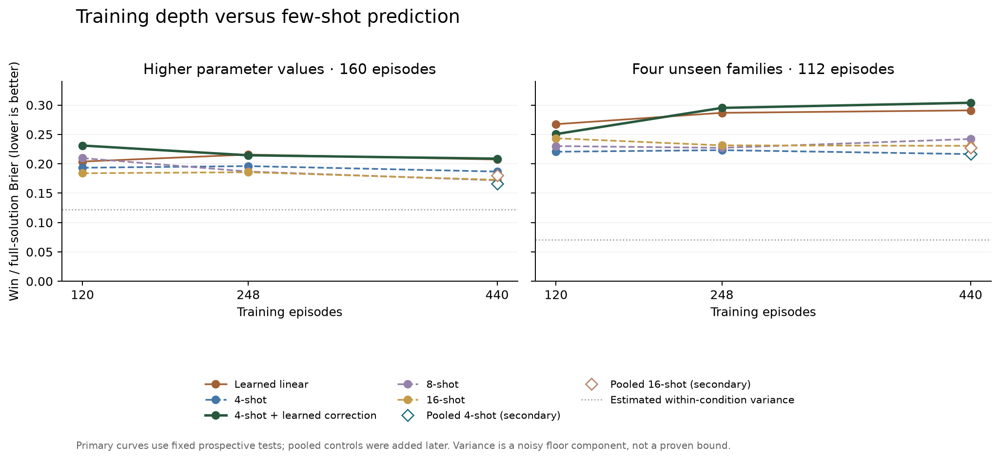

# Replicated general-game study: training headroom and expansion

[Viewer](http://localhost:42329/general/replicated) · [Results JSON](summary.json) · [Protocol](protocol.json) · [Prospective freeze](prediction/frozen.json)

The catalog now contains **16 families and 57 native configurations**. This stage collected **592 new episodes**: 320 training episodes and 272 prospective test episodes. The four anchor families have five independent LLM repetitions per exact condition, with world seed and seat fully crossed. Four additional native families—Ultimatum, Two-Thirds Average, Secretary and Memory—have two repetitions per condition.

New collection uses the original normal player prompt, both player models, one provider, and unchanged native mechanics. Historical training includes both prompt conditions. Native/scripted validation is separate from model observations. There is no selection for gameability.

## What the completed study supports

Few-shot still leads on general win prediction; the current learned predictors do not justify scaling training volume.

- **Parameters — Behavior varies:** PD cooperation falls .567 → .533 → .492 as the defection reward increases. Blotto concentration falls .483 → .466 → .451; auction budget use falls .996 → .900 → .647. Pig mean focal actions rise 5.225 → 7.675 → 14.100. Each level has 40 episodes; auction rate support is 30/33/35. These are descriptive responses, with the higher setting collected in a later batch.
- **Models — Differences depend on family and target:** GLM wins Memory in 10/16 episodes versus Qwen 5/16, and uses an available known pair more often (.943 vs .718). Auction invalidity occurs in 30/60 GLM episodes versus 6/60 Qwen episodes. PD cooperation differs (.661 GLM vs .400 Qwen) despite every fresh PD episode being a native win.
- **Labels — Native measurements reproduce; stochastic variation remains:** All 5,608 new native transitions replay, with independent payoff/selection/pair-score checks. Repeated win outcomes vary in 51 of 152 exact conditions. All 120 PD wins are identical, while cooperation varies in 13/24 PD conditions. Outcome saturation is a reason to retain richer behavior targets.
- **Few-shot and training — Few-shot remains ahead for wins:** At 440 episodes, corrected-4 minus four-shot win Brier is +.0220 on parameters and +.0874 on new families; paired family-bootstrap intervals are [.0093,.0315] and [.0187,.1524]. The correction gets worse on new-family wins as training grows (.2506 → .2952 → .3039). These intervals condition on the fitted forecasts and only four families per test.
- **Representation — Improved and reproducible; predictive sufficiency is unproven:** The release supplies exact actor openings, corrected native parser/payoff/initialization and numerical opponent descriptions, plus authoritative executable sources. Hidden realizations and future events remain unavailable. There is no matched representation ablation in this version, so completeness of the source bundle is not proof that its compact forecast rendering is sufficient.

Remaining error leaves room for better predictors, but these learners do not capture it broadly. Direct linear prediction still leads auction budget-use MSE (.0778 versus the best tested few-shot .0911) and narrowly leads Blotto concentration (.0042 versus .0043). The apparent Pig-rate advantage over original four-shot (.0047 versus .0160) disappears against pooled four-shot (.0038). Each behavior target is supported by one family here; these are narrow signals, not established general training gains.

The collection/label pipeline supports selective expansion to additional game families under this protocol. The win-prediction learning curves do not support a large scale-up of the present linear/correction methods. A stronger next study should vary training-family breadth at a fixed label budget, retain pooled 4/8/16-shot controls, and use more held-out families plus informative behavior targets.



## Training versus few-shot

Learning curves use 120 historical episodes, then those 120 plus two fresh repetitions of each of 64 training conditions (248 episodes), then all five repetitions (440 episodes). Training groups from the four new families and the upper anchor configurations are excluded at every size. Higher-value historical observations are also excluded. Both the direct linear learner and the correction use equal total weight per training family; within each family, replicate means are weighted by their measured counts.

Few-shot methods use 4, 8 or 16 distinct observable-input examples, retrieved by game-structure/text similarity and then player/prompt/seat. The example sets are nested. Each primary demonstration contains the empirical mean and repetition count for one exact world condition; if multiple seeds have identical visible inputs, retrieval retains one such condition rather than pooling their labels. The learner uses all training groups. A secondary pooled-label control below addresses this loss of information. Exact actor opening messages and the same corrected mechanics specification are provided at every size. This study tests the original pretrained forecaster plus learned corrections; it does not train a new language encoder from scratch.

The learned correction is a fixed Ridge model trained on normal-prompt condition means and forecasts generated with each calibration query’s entire family excluded from examples. Calibration uses 60, 124 and 124 condition groups across the three sizes; later groups have more outcome repetitions. A fixed logistic/Ridge model with structured and training-only TF–IDF features and a training-mean baseline are also reported. Hyperparameters, shot counts and the primary corrected-4 versus few-4 comparison were fixed before fresh test play.

Lower Brier/MSE is better. Scores average repetitions within a condition, conditions within a family, then families equally. The parameter test contains 32 conditions / 160 episodes across four anchor families; the new-family test contains 56 conditions / 112 episodes across four unseen families.

### Parameter holdout: win / full-solution Brier

| Method | 120 training episodes | 248 | 440 |
|---|---:|---:|---:|
| training_mean | 0.2338 | 0.2290 | 0.2287 |
| linear | 0.2038 | 0.2157 | 0.2073 |
| few_4 | 0.1933 | 0.1961 | 0.1867 |
| corrected_4 | 0.2311 | 0.2145 | 0.2087 |
| few_8 | 0.2097 | 0.1868 | 0.1718 |
| corrected_8 | 0.2123 | 0.1989 | 0.1962 |
| few_16 | 0.1839 | 0.1856 | 0.1727 |
| corrected_16 | 0.2019 | 0.2278 | 0.2317 |

At 440 episodes, corrected-4 minus few-4: **+0.0220**, paired 95% family-bootstrap interval **[+0.0093, +0.0315]**. Negative favors training. Four held-out families are still a small sample; uncertainty conditions on the fitted models and forecasts.

### Family holdout: win / full-solution Brier

| Method | 120 training episodes | 248 | 440 |
|---|---:|---:|---:|
| training_mean | 0.2470 | 0.2473 | 0.2474 |
| linear | 0.2674 | 0.2867 | 0.2909 |
| few_4 | 0.2205 | 0.2232 | 0.2165 |
| corrected_4 | 0.2506 | 0.2952 | 0.3039 |
| few_8 | 0.2302 | 0.2271 | 0.2422 |
| corrected_8 | 0.2555 | 0.2625 | 0.2737 |
| few_16 | 0.2434 | 0.2314 | 0.2306 |
| corrected_16 | 0.2695 | 0.2983 | 0.3263 |

At 440 episodes, corrected-4 minus few-4: **+0.0874**, paired 95% family-bootstrap interval **[+0.0187, +0.1524]**. Negative favors training. Four held-out families are still a small sample; uncertainty conditions on the fitted models and forecasts.

### Secondary control: pool repeated labels for identical visible examples

At 440 episodes, the 184 exact-condition groups have only 124 distinct visible inputs. The primary retrieval retains one group per input. The secondary control pools every training label/count for each identical input, keeping **exactly the same selected example IDs, order, shot counts, actor messages, mechanics and predictor settings**. It uses training inputs/labels only. This control was specified and called after prospective test play began, so it is a separate input-only secondary comparison, not part of the original prospective freeze. No test outcomes select its examples, pooling rule or settings.

| Holdout | Original 4-shot | Pooled 4-shot | Pooled 8-shot | Pooled 16-shot | Learned linear | Original 4-shot + learned correction |
|---|---:|---:|---:|---:|---:|---:|
| parameter | 0.1867 | 0.1657 | 0.1695 | 0.1798 | 0.2073 | 0.2087 |
| family | 0.2165 | 0.2170 | 0.2274 | 0.2271 | 0.2909 | 0.3039 |

Pooling fixes underuse of labels for identical visible inputs, but the fitted learner still compresses all training groups while a prompt contains at most 16 examples. This is a practical training-versus-prompting comparison, not an isolated test of architecture with identical label access.

## Repetition and parameter effects

Repeated native traces are independently sampled LLM decisions under identical configuration, world seed, seat, model and prompt. A changed action sequence is therefore possible even when the starting state is identical. Seed repetitions are not new game designs. We report within-condition outcome variance separately from deterministic replay correctness.

| Family | Episodes | Exact conditions | Conditions with varying win/solution labels | Mean within-condition win variance |
|---|---:|---:|---:|---:|
| Blind Auction | 120 | 24 | 14 | 0.1458 |
| Colonel Blotto | 120 | 24 | 19 | 0.1958 |
| Memory Game | 32 | 16 | 5 | 0.1562 |
| Pig Dice | 120 | 24 | 10 | 0.0958 |
| Iterated Prisoner's Dilemma | 120 | 24 | 0 | 0.0000 |
| Secretary | 16 | 8 | 1 | 0.0625 |
| Two-Thirds Average | 32 | 16 | 1 | 0.0312 |
| Iterated Ultimatum | 32 | 16 | 1 | 0.0312 |

Within-condition sample variance estimates one component of the attainable Brier/MSE floor under this observation and repetition protocol. It is noisy, especially with two repetitions. `noise_subtracted` subtracts that estimate from predictive error and can be negative due to estimation noise; it is not proof that all remaining error is learnable. Unobserved world variation between seeds can add further uncertainty.

| Family / behavior | Parameter | Low (measured episodes) | Base (measured episodes) | High (measured episodes) |
|---|---|---:|---:|---:|
| Iterated Prisoner's Dilemma / cooperation_rate | defect_reward | 0.567 (n=40) | 0.533 (n=40) | 0.492 (n=40) |
| Pig Dice / risk_taking_rate | winning_score | 0.730 (n=40) | 0.729 (n=40) | 0.762 (n=40) |
| Colonel Blotto / allocation_concentration | num_total_units | 0.483 (n=40) | 0.466 (n=40) | 0.451 (n=40) |
| Blind Auction / bid_budget_fraction | starting_capital | 0.996 (n=30) | 0.900 (n=33) | 0.647 (n=35) |

### Model differences in fresh normal-prompt episodes

| Family | Qwen win / solution rate | GLM win / solution rate | Paired win difference | Qwen invalid-episode rate | GLM invalid-episode rate |
|---|---:|---:|---:|---:|---:|
| Blind Auction | 0.667 | 0.617 | +0.050 | 0.100 | 0.500 |
| Colonel Blotto | 0.350 | 0.367 | -0.017 | 0.000 | 0.000 |
| Memory Game | 0.312 | 0.625 | -0.312 | 0.188 | 0.000 |
| Pig Dice | 0.517 | 0.700 | -0.183 | 0.000 | 0.000 |
| Iterated Prisoner's Dilemma | 1.000 | 1.000 | +0.000 | 0.000 | 0.000 |
| Secretary | 0.375 | 0.250 | +0.125 | 0.000 | 0.500 |
| Two-Thirds Average | 0.812 | 1.000 | -0.188 | 0.000 | 0.000 |
| Iterated Ultimatum | 0.562 | 0.500 | +0.062 | 0.000 | 0.062 |

Fresh normal-prompt collection only. Equal weight per family, with each model compared on matching configuration, seed and seat. Repetitions are averaged first. This is a descriptive comparison across eight purposively selected families. Full behavior-rate differences are retained in summary.json.


Each anchor setting has 40 episodes, with two models × two world seeds × both seats × five repetitions. Lower/base values were collected before forecasting; higher values were collected afterward. This improves replication and removes seed/seat confounding, but collection batch is still coupled to the prospective parameter split.

## Representation and label contracts

The release includes standardized initialization/information, transitions/payoffs, termination, parser and invalid-action fields, exact actor opening messages, numerical scripted-opponent policies, and an archived executable native source bundle. The complete executable rules remain authoritative; the LLM uses a compact normalized rendering. Hidden opponent realizations and future events are excluded. A specification revision before fresh test play corrects positive auction bids, duplicate/partial bid processing, auction and negotiation private-value distributions, Liar’s Dice elimination and Pig’s horizon timing. Earlier forecasts made with the initial wording are preserved under prediction/preflight and excluded from scoring.

New supported measures cover auction budget use, dice challenges, negotiation offers/acceptance, Ultimatum offer shares/acceptance, normalized numeric guesses, secretary selection timing, and memory use of known pairs/new cards. Definitions record actual eligibility; fixed-role Ultimatum targets are masked before outcomes are known. Unsupported targets stay null. Intent, deception, exploitation and a general psychological exploration trait are not inferred.

Native replay: **5,608 transitions** across the new collection. Independent accounting checks: `{'pd_round_payoffs': 360, 'auction_capital_changes': 98, 'two_thirds_round_points': 96, 'ultimatum_round_payoffs': 96, 'secretary_maximum_checks': 16, 'memory_pair_scores': 527}`. All raw inference links and global/stage ledgers reconcile. The source archive and exact prompts preserve every collection and prediction setting.

## Prospective chronology and usage

All 2,112 primary test predictions and fitted artifacts were frozen at **2026-09-11T00:29:27.934833+00:00**. The first fresh test-player call was **2026-09-11T00:29:37.294870+00:00**. All three training sizes predict the same fixed test conditions. The 264 supplemental pooled-example predictions have separate later timestamps and are marked secondary.

This stage made 3,607 inference attempts, with **$27.9994** reported cost and 0 calls lacking final cost. This includes retained preflight forecasts; group-level usage is in summary.json. The global ceiling was $75; no budget increase was made.

The family expansion is a targeted sample of four new decision structures, not a representative random sample of all games. Only two player models and one new prompt condition are tested. Learning-curve growth is concentrated in the four anchor families, so these curves measure added depth and repetition rather than a controlled increase in training-family breadth. The new families remain a prospective transfer test.

```bash
/shared/allie/venvs/hole/bin/python -B -m prediction.general_games.scaleup_v2.readout
/shared/allie/venvs/hole/bin/python -B -m pytest prediction/general_games/scaleup_v2/test_contracts.py prediction/general_games/scaleup_v2/test_predict.py -q
```
