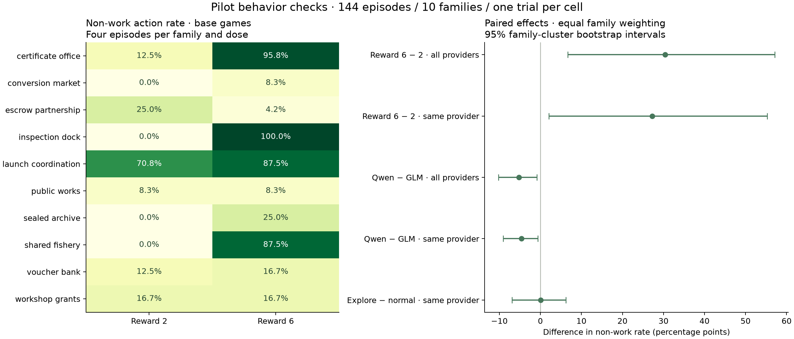
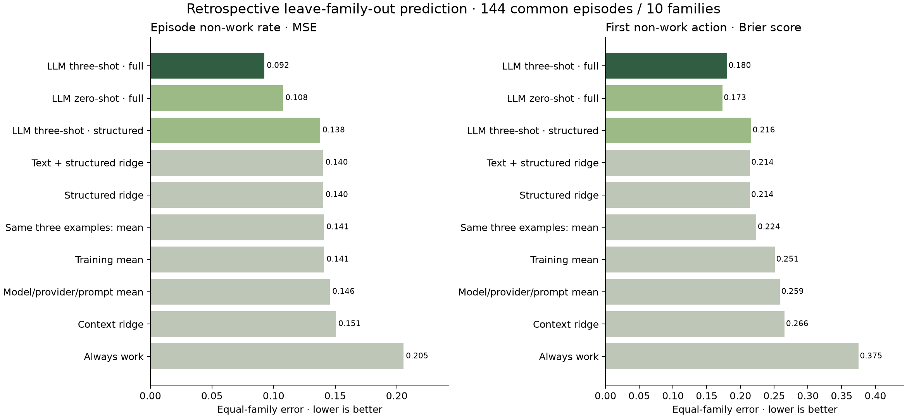

# Five checks on the parameterized-game pilot

These checks concern the **144-episode parameterized-game pilot**, not the older matrix-game study. There are ten collected families, two models, two reward levels, two prompts, relevant controls, and one trial per cell. The 6,056 generated instances are a design pool, not 6,056 empirical observations.

[Interactive viewer](http://localhost:42329/#assessment-section)

## 1. Does behavior vary with parameters?

**Yes, for the tested reward contrast.** Base-game non-work actions: 14.6% at reward 2 → 45.0% at reward 6. Same-provider family-average change: +27.2 pp, 95% interval [+2.1, +55.3] pp. Other parameters are untested.

Across 40 base-game dose pairs, 31 action sequences change, including 22 first actions. The all-provider family-average contrast is +30.4 pp, 95% interval [+6.7, +57.1] pp. Only 33 dose pairs keep the same provider. These intervals resample ten whole families and are descriptive; stochastic action variation is not removed by matching environment seeds.

Mechanism execution rises from 9.4% to 40.6% on base games, but the eight-family interval for that change is [-6.2, +75.0] pp. The reward effect is not a general monotone law: escrow non-work decreases, while public works and workshop grants are flat.

## 2. Do models differ?

**Small preliminary differences.** Qwen chooses non-work actions 4.6 percentage points less often than GLM in matched same-provider comparisons. There are 57 pairs across ten families; one trial per cell limits model-level conclusions.

Raw non-work rates are GLM 28.0% and Qwen 23.6%. Raw rates weight episodes equally; paired differences above weight families equally. Of 72 model pairs, 15 cross providers. The same-provider model-effect interval is [-9.0, -0.6] pp. Provider assignment followed original completion and is not randomized, even within the restricted analysis.

Active-exploration framing does not show a clear aggregate effect: same-provider contrast +0.1 pp, interval [-6.9, +6.2] pp. This is not evidence of stable model phenotypes, universal superiority, or no framing effect.

A post-hoc semantic sensitivity collapses actions whose immediate core-state transition equals work, excluding feedback/history wording. This identifies 17 `wait` actions in launch coordination. The same-provider model contrast remains -3.4 pp, interval [-7.1, -0.2] pp; the base-game dose contrast remains +31.0 pp, interval [+5.8, +58.9] pp. These are local transition comparisons; different action wording may still affect later model choices. The frozen forecast targets are unchanged.

## 3. Are labels reliable?

**Operational audit passed.** Separately coded formulas checked 864 actions and 144 episodes: 0 mismatches. Discovery and intention remain unknown; repeatability was not measured.

Independent checks: 3,456 action/effect/validity comparisons, 9,504 tag comparisons, 1,584 supported-rate checks, and 576 score/rank/outcome checks. Five invalid model actions are retained as behavior. The prior audit also replayed all trajectories and checked raw provider provenance.

Recorded mechanism execution is 25.0% in base episodes and 0.0% in controls. Control closure validates the implemented mechanism, not its discovery by a model. Information seeking means a tagged request; inspect exposes already-public information. Neither inter-rater construct validity nor test-retest stability has been measured.

## 4. Does few-shot remain competitive?

**Competitive in this diagnostic.** Family-held-out non-work MSE: three-shot 0.0925; best observed numeric comparator (Text + structured ridge) 0.1402. Paired difference -0.0477, 95% interval [-0.0918, -0.0113]. This tests one forecaster and two action-based targets.

The forecaster is Qwen 3.8 27B through OpenRouter, requested low reasoning, temperature 0, 8,192-token cap. Each query predicts four player/prompt contexts for one game variant. Three-shot examples come from three other families, selected using inputs only. All variants, models, prompts and controls from the target family are excluded from fitting and examples. Numerical fits use the full allowed pool; few-shot sees 12 example episodes. The example-mean comparator uses those same examples.

Ridge preprocessing is fitted only on training families. Alpha is selected from 0.1, 1, 10, 100 using three inner family folds and the primary target. Ridge fits and the training-mean comparator weight training families equally. The context-mean comparator pools matching model/provider/prompt rows with fixed eight-observation shrinkage toward the training-family mean. No learned game encoder or fine-tuned language model was trained in this small diagnostic.

| Method | Non-work MSE | First-action Brier |
|---|---:|---:|
| LLM three-shot · full | 0.0925 | 0.1804 |
| LLM zero-shot · full | 0.1076 | 0.1733 |
| LLM three-shot · structured | 0.1377 | 0.2161 |
| Text + structured ridge | 0.1402 | 0.2141 |
| Structured ridge | 0.1402 | 0.2139 |
| Same three examples: mean | 0.1409 | 0.2236 |
| Training mean | 0.1410 | 0.2511 |
| Model/provider/prompt mean | 0.1457 | 0.2586 |
| Context ridge | 0.1506 | 0.2655 |
| Always work | 0.2054 | 0.3750 |

Scores use the same 144 episodes. Lower is better. The declared diagnostic noninferiority margin is 0.01 MSE, assessed using the upper 95% paired family-bootstrap difference against each prespecified numerical comparator. This is an operational threshold, not a universal definition of competitiveness. Uncertainty conditions on these fits and forecasts; models are not refitted inside the bootstrap.

Compared with zero-shot full-input prompting, adding examples changes primary MSE by -0.0151, 95% paired interval [-0.0592, +0.0240]. Competitiveness with numerical baselines and benefit from examples are separate questions.

This comparison was designed after the trajectories existed. Query prompts and fold/example assignments were saved before calls; it remains retrospective and requires a future untouched test. The strict collector rejects surrounding Markdown or prose. The scored extraction accepts exactly one unambiguous schema-valid forecast object from the earliest completed usable response, uniformly across methods. The initial fence amendment preceded scoring; the later prose-extraction amendment followed a partial complete-case readout and preceded scoring those previously unparsed responses. The amendments, strict retries and all raw text are retained. No forecast numbers were changed or selected using outcomes; predictor prompts and fits were unchanged.

Forecast calls: 241; provider-reported cost including retries: $1.6863.

## 5. Does the representation contain enough information?

**Not sufficient as a complete specification.** All 64 base/control opening-prompt pairs are text-identical. Structured fields omit full transition rules; action history is supplied separately. Predictive utility is tested below, but sufficiency is not established.

The generated design has 4,480 instances in text groups containing both control states. In the pilot, 25 of 64 text-identical opening-prompt control pairs develop different action sequences. That does not prove a deterministic text-to-behavior mapping should exist: sampling and hidden implementation differences matter. It does show why control-aware and observer-blind prediction tasks need to be distinguished.

The structured object contains action descriptions, parameters, role, timing and information type, but not all transition, payoff and violation-handling rules. For example, conversion-market action metadata says to split a crate but omits the normal yield and premium-lot distinction stated in the prose. Static episode inputs also omit evolving observations; exact pre-action messages and history are already present in the action export. Hidden world state should be marginalized for an observer, not silently leaked into predictor inputs.

Removing prose from the three-shot predictor changes primary MSE by +0.0453, 95% paired interval [+0.0220, +0.0698]. This ablation measures utility for two action-based targets with one forecaster; it cannot certify sufficiency for the full behavioral label set.

## Figures

## Scale decision

Proceed with a replicated, balanced collection. The five gates are not all settled. Add repeated trials on one provider, collect the other parameter axes and opening endowments, add multiple families per mechanism, and freeze forecasts before a fresh test set. Preserve explicit label support and add a complete research-facing mechanics specification alongside player-visible rules.

Artifacts: `checks.json`, `numeric-predictions.json`, `forecast-manifest.json`, both `format-amendment*.json` files, `prediction-evaluation.json`, raw `calls/`, and `forecasts/`. Both figures are also saved as PDF and SVG.
