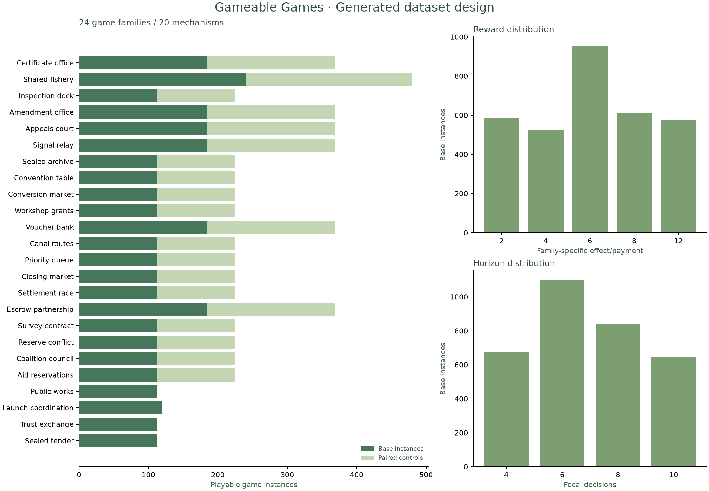
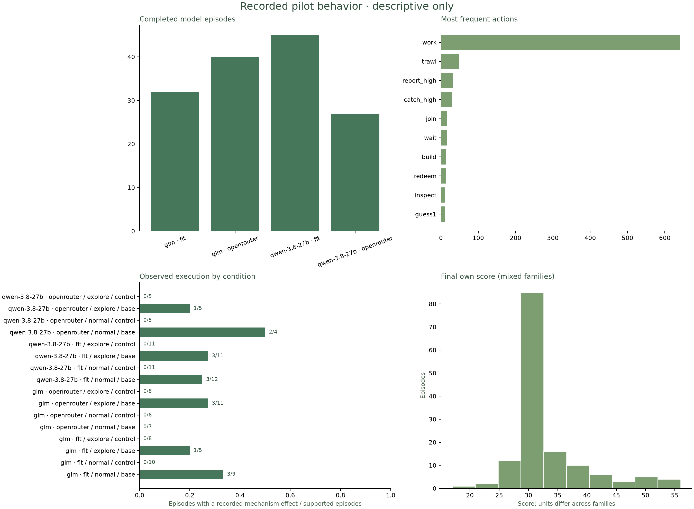

# Parameterized behavioral dataset · first build

The design contains **6,056 playable instances**: 3,256 base games plus 2,800 controls, covering 24 families and 20 mechanisms.

The separate live pilot contains **144/144 complete episodes** and 864 focal decisions. 0 episodes are incomplete; 0 have not started. 5 recorded actions were invalid under the game rules and are retained as observed behavior. Scripted witness fixtures are excluded from all empirical results.
The collection retains 77 complete FLT episodes and restarts the other 67 episodes through OpenRouter, from their original opening states. The OpenRouter routes are `qwen/qwen3.8-27b` and `z-ai/glm-5.3`. Each episode uses one provider throughout, with the same game, model identity, seed, seat, prompt, temperature, reasoning request and token cap. Provider is shown separately in the behavior plots. Provider assignment followed prior completion and was not randomized; provider comparisons are confounded.


Open the [interactive viewer](http://localhost:42329) for all distributions, filtered samples, exact prompts/replies, state transitions and paired comparisons.



## Collection

| Model | Complete episodes | Mechanism effects / supported episodes |
|---|---:|---:|
| glm · flt | 32 | 4 / 32 |
| glm · openrouter | 40 | 3 / 32 |
| qwen-3.8-27b · flt | 45 | 6 / 45 |
| qwen-3.8-27b · openrouter | 27 | 3 / 19 |



## Scope and limits

The pilot crosses 10 families, reward values 2 and 6, two models, normal/exploration framing, and relevant controls. There is one trial per cell and one opening-endowment construction. In this opening the focal player starts at 20 and each rival at 18; routine work can preserve a lead in many families. This is a collection and measurement pilot, not a reliable estimate of behavioral thresholds or model rankings. The full generated design varies public endowments across eight constructions, including rival leads.

Discovery and unobserved intention labels remain null. Execution records the specified engine effect, not a mental state, net reward, or win. Same-state counterfactuals are local one-action comparisons. Mechanism and family holdouts are not independently identified because this version has one family per mechanism.

The 2,048-token calibration pass is retained separately and excluded here. The final pilot uses a uniform 16,384-token cap and requested low reasoning. Transport failures retain unknown billing and incomplete action checkpoints; retries use the same fixed protocol, with at most three attempts per decision. Truncated responses remain in the raw call logs and are not scored as actions. Conditioning on successful completion can bias observed behavior.

## Validation and provenance

- 54,504 scripted episode replays; 373,206 transitions.
- 69,816 purity and deterministic transition checks.
- 5,864 single-parameter or control edges; grouped split isolation checked.
- Engine/design/checkpoint, provider routing, continuation provenance and viewer/API tests accompany this build; Chromium checks cover desktop/mobile, filtering, samples, pairs and exports.
- Every exported live trajectory is replayed and checked against raw provider calls. Unknown/failed inference is never converted into an action.

Reported API usage across the contributing collection runs, including abandoned partial episodes and retries. FLT used a hosted allocation; dollar costs below are those reported for OpenRouter requests. Calibration and provider preflight calls are excluded; transport failures can have unknown billing:

```json
{
  "requests": 978,
  "status:ok": 900,
  "prompt_tokens": 702814,
  "completion_tokens": 854415,
  "total_tokens": 1557229,
  "reported_cost_usd": 1.9844837770000003,
  "status:invalid_response": 1,
  "status:truncated": 10,
  "status:transport_error": 67
}
```

Machine-readable companion: `viewer-summary.json`. PNG, SVG and PDF versions of both figures are saved alongside this report.

## Pilot assessment

The [five-check assessment](../../../assessments/pilot-checks-20260910/REPORT.md) reports matched reward/model effects, independent operational-label checks, family-held-out few-shot baselines, and representation limitations. Its plots and score table are also in the interactive viewer.
