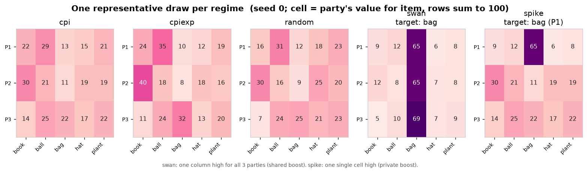
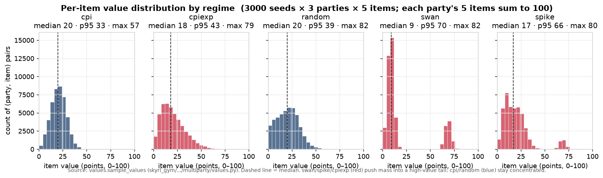

STRATEGY_BLOCK_MISREPRESENTATION = """
# Declare values strategically
Don't leak your private values to other parties easily; you are free to withhold or fabricate your values to get more value from the negotiation due to other parties' uncertainty about your values.
Some examples of this:
- Avoiding desperation: if one item is worth a lot to you, saying "it's important to me" is fine, but be careful about revealing HOW important it is, as it may signal desperation and allow others to extract everything else as ransom
- Misrepresent to misdirect: You can state a false preference ordering as a decoy: if you secretly value plant over hat, you could tell a rival "hat matters more to me" to draw their attention away from plant, so you win it cheaply
- Frame worthless items as costly concessions: Giving away an item you don't value costs you nothing but reads as generosity, spend these to buy goodwill or extract real items in return.
But you can also discover new strategies too!
"""

# Value initialization sweeps

3-party self-play, 8 rounds, 12 episodes/run, seed 0 (scenarios
matched across models within each arm), judge `claude-sonnet-4.6`. Five value
regimes × four models (`sonnet-5`, `gpt-5.5`, `qwen3.5-27b`,
`qwen3.5-35b-a3b`), runs under `results/multiparty/regimes/<arm>/<model>`,
full writeup `multiparty/REPORT_REGIMES_0720.md`. Question: which value
initialization produces the most interesting dynamics to train a superhuman
negotiator on?

| arm | construction |
|---|---|
| `cpi` | baseline: uniform base, α=0.4 |
| `cpiexp` | varying item means: exp base (item-mean spread ≈24 pts vs 15 baseline, tails to 45+) |
| `random` | pure idiosyncratic (α=0) |
| `swan` | black swan: one item ≈65 pts *for everyone* |
| `spike` | one random party values one item ≈65 |

## What the initializations look like

All five arms come from `values.sample_values` (`skyrl_gym/.../multiparty/values.py`):
each party draws `raw = α·common + (1−α)·eps`, then `swan`/`spike` add one
targeted boost of `strength × base_total` before every vector is re-normalized to
100 points. `cpiexp` is just `cpi` with an exponential base distribution.

A single seed-0 draw makes the structural signature obvious — `swan` boosts one
item for **all** parties (a full column), while `spike` boosts one item for **one**
party (a single cell):

Aggregated over 3000 seeds, the distributive character of each arm shows up in the
tail of per-item values: `cpi`/`random` stay concentrated (max ≈57–82), `cpiexp`
grows a heavier tail (p95 43), and `swan`/`spike` carve out a distinct high-value
cluster near ≈65 — the boosted item — while pushing the rest toward the low-value
scraps:

Figures regenerate via `figs/make_regime_figs.py`.

## The numbers (cross-model arm means; qwen27b/spike excluded — prompt-version contamination)

| arm | efficiency | NBS product ratio | logrolling (wtd) | deception rate |
|---|---|---|---|---|
| cpi | 0.928 | 0.806 | 0.666 | 0.114 |
| cpiexp | 0.925 | 0.741 | 0.740 | 0.129 |
| random | 0.946 | 0.829 | 0.819 | 0.103 |
| swan | 0.922 | **0.606** | **0.404** | **0.081** |
| spike | **0.967** | 0.857 | 0.856 | **0.145** |

Agreement is 100% in every cell — the standing-offer protocol is robust to all
five initializations.

## What each regime does to the dynamics

- **swan — the distributive crucible.** Fairness collapses (NBS 0.53–0.73 per
  cell) because someone must win the ~65-pt item and the scraps can't
  compensate the other two. Longest negotiations (r6.3–6.7 vs ~4.5 elsewhere),
  most talk — and the *least* deception, with near-perfect mutual value
  knowledge (judge MAE 0.4 on qwen35b): values are effectively common
  knowledge, so the game is a pure positional fight over who eats the loss.
  (Logrolling is a noisy metric here: everyone's top item is near-tied.)
- **spike — the information-asymmetry arm.** Highest efficiency (the spiked
  item almost always reaches the spiky party) but the study's highest
  deception (sonnet/gpt ~21%) and gpt-5.5's lowest message readability
  anywhere (ρ 0.47): desperation-hiding and ransom-pricing emerge without
  being prompted. The Qwens' spiky seat gets squeezed (NBS ~0.71).
- **cpiexp — fairness stress that splits by model family.** Frontier holds
  NBS 0.80–0.89 while both Qwens crash to ~0.63 (big-ticket items become
  winner-take-most against weaker bargainers); gpt-5.5's deception peaks here
  (23.5%).
- **random — the integrative playground.** Easiest to be jointly good at:
  best balance, most honest, abundant gains from trade, little conflict.
- **cpi** sits between random and the stress arms on every metric.

## Recommendation

**spike is the most interesting single arm for
training**: it uniquely rewards information control (conceal your own spike,
detect and price others'), shows today's largest honest-vs-strategic spread
across models, and has a clean per-episode skill readout (did the spiky seat
keep its surplus or get ransomed?). **swan** is the best distributive stressor
(largest fairness variance → strong extraction-gradient signal, but low
elicitation content). 

## Caveats

12 episodes/cell, single judge, temp 0.7. `qwen27b/spike` ran under the
misrepresentation-era prompt (the sweep straddled the prompt edit) and is
excluded from the means above — though on its own it is the most interesting
cell of the sweep: dec 19.2% with **benefited_frac 0.80** and readability down
to ρ 0.69, i.e. frontier-level *effective* deception from a Qwen
(plain-prompt qwen35b in the same arm: 1.9%). Read against the
misrepresentation finding above (where the same prompt on 35b/cpi produced
lies that didn't pay), this single cell suggests misrep-prompt × spike-regime
may be the combination that activates functional strategic play — worth a
deliberate 2×2 (prompt × regime) before trusting it; all other 19 cells used the pre-misrep prompt
with the one-line don't-leak guidance. That one-liner itself is
model-dependent: sonnet-5's cpi rerun matches its original-prompt numbers
(dec 18.1% vs 16.6%) while gpt-5.5's doubled (16.5% vs 8.8%) — worth keeping
prompt version pinned in future cross-run comparisons (now a first-class flag:
`--prompt-version`).

# Prompt × regime 2×2: instructed deception is a model capability, amplified by regime

Follow-up to the two sections around it: does misrep-prompt × spike-regime
activate *effective* deception in Qwen, and is it the prompt, the regime, or
the pair? Fresh 2×2×2 — `--prompt-version {plain, misrepresentation}` ×
`--regime {cpi, spike}` × {qwen3.5-27b, qwen3.5-35b-a3b} — all 8 cells rerun
under the current versioned prompts (no era mixing), 12 eps, seed 0, r8,
judge sonnet-4.6. Runs: `results/multiparty/prompt2x2/<version>/<regime>/<model>`.

| cell | dec rate | benefited frac | msg-value ρ |
|---|---|---|---|
| 27b plain/cpi | 0.038 | 0.92 | 0.89 |
| 27b plain/spike | 0.057 | 0.65 | 0.82 |
| 27b misrep/cpi | 0.118 | **0.88** | 0.85 |
| 27b **misrep/spike** | **0.186** | **0.70** | **0.73** |
| 35b plain/cpi | 0.022 | 0.83 | 0.92 |
| 35b plain/spike | 0.035 | 1.00 | 0.86 |
| 35b misrep/cpi | 0.041 | 0.60 | 0.95 |
| 35b misrep/spike | 0.069 | 0.67 | 0.85 |
# Base hunt: qwen3.6-27b is the post-training base

Swept 6 open trainable (≤35B) candidates against incumbent qwen3.5-27b on four
cells (plain/cpi, plain/spike, misrep/spike, pair_or_grand cpi w/
`--grand-dividend 0.25`); 12 eps, seed-matched, judge sonnet-4.6. Full table:
`multiparty/REPORT_BASEHUNT_0720.md`; runs `results/multiparty/basehunt/`.

**Winner — qwen3.6-27b**, on every axis: best fundamentals of anything tested
today incl. frontier (cpi eff 0.958, spike 0.973, 100% closing everywhere);
natively strategic where 3.5 was transparent (plain-prompt dec 12–13% @ ben
0.85–0.93, ρ 0.69–0.73); the largest instructable range (misrep/spike → dec
0.227 @ **ben 0.98**, ρ 0.64, no efficiency cost) — frontier-level effective
deception from an Apache-2.0 27B dense; and the most calibrated coalition
extractor (58% pair-defection under a 25% grand dividend, exclusions spread
across seats, still 100% agreement).

**Runner-up — gemma-4-31b**, the opposite disposition: fairest efficient play
in the study (NBS 0.88–0.94), best concealment (ρ 0.57), natively profitable
deception, but a pure cooperator under the dividend (0% pair deals). Use as
cooperative-prior base (cleaner attribution: RL would have to *discover*
extraction) or as opponent-pool model. License caveat vs Qwen Apache-2.0.

Eliminated: gpt-oss-20b + nemotron-3-nano-30b (agreement 0.25–0.58, incoherent
lying: dec 33–40% @ ben ≤0.4); mistral-small-2603 (natively strategic but weak
fundamentals, eff 0.81); qwen3.6-35b-a3b (fixed the a3b gap in unanimity but
collapses under coalition pressure: 78% pair, 25% no-deals, dog-piles the
first mover). olmo-3-32b-think: no OpenRouter endpoints, unevaluated.

Coalition-cell side-finding: pair-defection rate under an identical 25%
dividend spans 0%→78% across competent models (gemma 0, mistral 9, q3.5-27b
33, q3.6-27b 58, q3.6-35b 78) — the pair_or_grand + dividend knob is a clean
behavioral spectrometer for cooperative↔extractive disposition, independent of
raw deal-making skill.

Caveats: 12 eps/cell, single dividend value (0.25), pure self-play (no
cross-play disambiguation of disposition vs skill yet).

# TextArena cross-play (0720 overnight): self-play rank ≠ cross-play rank

Different game surface (TextArena N-player `Negotiation`: 5 resources, private
values, broadcast+whisper+bilateral trade offers) to test generalization of
the base-hunt picture. Ported the stale/commented-out env to current core;
runner + analysis + judge in `/workspace/allie/TextArena/negotiation_crossplay/`
(full writeup `FINDINGS_0720.md`). 5 models cross-played (seats rotate),
metric = own-value **gain** (final−initial inventory under own values; not
zero-sum, pie expands). Wide-valuation "integrative" regime + a stock contrast.

**Headline (answers "where's the frontier gap?"): the frontier has NO gap
here — the OPEN models do, and self-play hid it.** qwen3.6-27b, which won every
self-play table in the base hunt, is the WEAKEST value-capturer in cross-play:

3p integrative gain (offers/accepts per game): gemma-4-31b **+289** (2.4/5.0),
gpt-5.5 +235 (21.1/1.2, invalid 0.17), sonnet-5 +168 (1.6/6.2), qwen3.5-27b
+64, **qwen3.6-27b +58 (0.9/0.9)**. 4p: gpt-5.5 +213, sonnet +208, gemma +154,
qwen3.5 +98, **qwen3.6 +46**.

Mechanism: qwen3.6 makes ~0.9 offers & ~0.9 accepts *per game* — it broadcasts
but never closes, leaving integrative surplus for others. Passive, not
exploited (gain small-positive). In self-play everyone under-trades
symmetrically so the smaller pie still splits evenly → qwen3.6 looked
dominant. **Cross-play is mandatory for base selection.** Trainable gap =
trade initiative/conversion, not talk. gemma-4-31b = strongest open trader +
good opponent-pool anchor.

Frontier styles differ: gpt-5.5 floods offers (18–21/game) → most gain but
highest invalid rate (0.17–0.19, occasional malformed/over-commit); sonnet-5 &
gemma are accept-heavy (let others propose, take good deals), clean (invalid
0.00–0.08).

Regime note: stock ±20% values = ratio 0.92 (no headroom), all models ~0 gain,
can't separate anyone → use wide/independent valuations for any negotiation
eval/RL reward. Metric: score own-value gain, NOT built-in winner-take-all
(endowment-dominated) or win rate.
