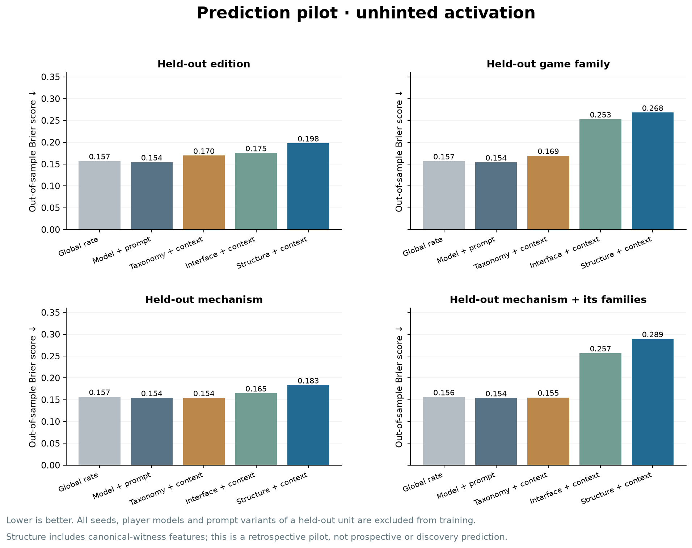
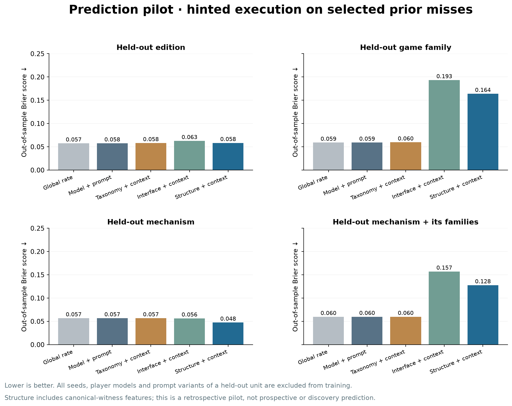
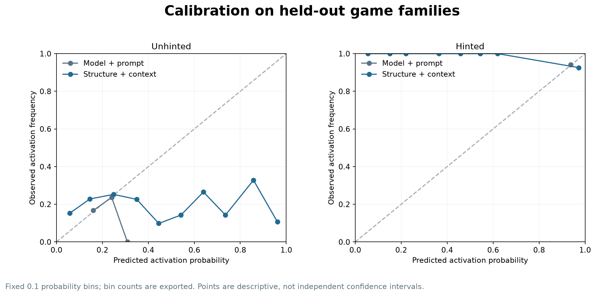

# Prediction pilot: can game structure predict activation?

**Result: this first structural predictor does not generalize better than the model/prompt baseline.**

On held-out game families, structural Brier is **0.268** versus **0.154** for the baseline. Holding out a mechanism and every game family containing it gives **0.289** versus **0.154**. Lower is better. This is a negative result for the specified features/model, not evidence that the entire research direction is impossible.

## What was implemented

- 45 eligible exploits, 17 editions, 10 base-game families, 16 mechanism types, three seeds; exact frozen revised45 engines.
- Fixed outcome snapshot at 2026-09-10T01:21:37.392005+00:00: **2677 unhinted trials**, plus **388 hinted trials** analyzed separately. No paid inference calls.
- Fourteen programmatic features: seven game/interface features plus seven canonical-witness features. The interface ablation uses only the first seven.
- Five references/predictors: global rate; player-model/prompt context; taxonomy plus context; interface plus context; full structure plus context.
- Four cross-validation schemes: held-out edition, held-out base-game family, held-out mechanism, and mechanism holdout that also excludes its game families.
- Fixed L2 logistic regression (10), training-fold-only scaling/encoding, no hyperparameter search, out-of-fold probability exports and reusable forecast artifacts.

## Prediction performance

Brier is mean squared probability error. Positive Δ below means structure is worse than context-only. Each model/prompt/target/seed is a trial; grouped holdouts prevent treating seeds or model variants of a target as unseen games.

| Evaluation | Trials | Context Brier | Structure Brier | Δ Brier | Descriptive family-block interval for Δ |
|---|---:|---:|---:|---:|---|
| unhinted: Held-out edition | 2677 | 0.1544 | 0.1979 | +0.0434 | [+0.0101, +0.0804] |
| unhinted: Held-out game family | 2677 | 0.1541 | 0.2681 | +0.1140 | [+0.0098, +0.2768] |
| unhinted: Held-out mechanism | 2677 | 0.1542 | 0.1834 | +0.0291 | [+0.0077, +0.0701] |
| unhinted: Held-out mechanism + its families | 2677 | 0.1538 | 0.2894 | +0.1356 | [+0.0263, +0.3044] |
| hinted: Held-out edition | 388 | 0.0576 | 0.0584 | +0.0008 | [-0.0159, +0.0136] |
| hinted: Held-out game family | 388 | 0.0591 | 0.1640 | +0.1049 | [-0.0019, +0.2728] |
| hinted: Held-out mechanism | 388 | 0.0568 | 0.0475 | -0.0093 | [-0.0362, +0.0040] |
| hinted: Held-out mechanism + its families | 388 | 0.0599 | 0.1277 | +0.0679 | [-0.0036, +0.1852] |







Intervals resample ten game-family blocks while holding the fitted out-of-fold forecasts fixed. They do not include feature-selection or model-refitting uncertainty and are not a confirmatory significance test.

## Where does it fail?

| Held-out game family | Unhinted trials | Observed activation | Context forecast | Structure forecast | Context Brier | Structure Brier |
|---|---:|---:|---:|---:|---:|---:|
| ref_battleship | 441 | 12.2% | 20.1% | 87.5% | 0.111 | 0.689 |
| gen_seven_seal | 240 | 5.8% | 20.4% | 39.6% | 0.074 | 0.178 |
| ta_ipd3 | 57 | 24.6% | 19.4% | 3.4% | 0.166 | 0.225 |
| ta_ipd | 176 | 33.5% | 18.2% | 34.0% | 0.245 | 0.295 |
| ref_exchange | 301 | 21.6% | 18.7% | 27.7% | 0.173 | 0.193 |
| ref_estate | 336 | 19.3% | 19.6% | 23.5% | 0.151 | 0.160 |
| ref_commons | 485 | 30.1% | 16.6% | 26.1% | 0.226 | 0.234 |
| ta_winasmuch | 165 | 8.5% | 20.3% | 18.6% | 0.091 | 0.097 |
| ref_auction | 301 | 20.9% | 18.8% | 18.1% | 0.160 | 0.165 |
| ref_hanabi | 175 | 10.3% | 19.9% | 6.1% | 0.103 | 0.088 |

The family-holdout errors show how far forecasts transfer to a different engine template. Good behavior on a held-out mechanism alone would not establish new-game generalization because other mechanisms from the same game family can remain in training.

## Feature definition and what the predictor knows

Ordinary game features: horizon; player count; number of action panels; numeric fields; unconstrained text fields; enumerated options; initial observation length.

Witness features: supplied canonical-witness length; first activation position relative to horizon; bracketed fields per action; auxiliary-interface use; prefix score cost relative to a normal script; own-score and competitive-advantage contrasts under a single-mechanism patch and scripted continuation.

The witness block assumes designer access to a known planted opportunity. It does not claim to infer the opportunity from player-visible rules. Witness length is not minimum search complexity; scripted payoff contrasts are neither optimal exploit values nor expected values over model policies. Generic features can proxy mechanism or game identity, which is why family-purged evaluation is included.

No target/game/family IDs, seed IDs, taxonomy labels, spec descriptions, raw action token identities, model responses or observed behavioral statistics enter the structural design matrix. Model × prompt context is allowed. Category labels appear only in the explicitly named taxonomy baseline and in split construction.

## What this does not establish

- **Discovery remains unmeasured.** These labels estimate activation, not `P(discovery)` or `P(execute | discovered)`. A hinted attempt is conditioned on an earlier miss and reveals a mechanism; it is not independently verified discovery.
- This is retrospective: aggregate outcomes were already known when the feature design was chosen. Cross-validation is genuine out-of-fold scoring, but the pilot is not a preregistered or prospective prediction test.
- Forty-five opportunities are nested inside ten families. More model/seed repetitions do not create more independent game structures. Failed/incomplete API episodes are omitted and may select the observed sample.
- Models and effort settings vary; known model/prompt identities are controlled only as nuisance predictors. Generalization to a new player model has not been tested.

## Recommendation

Treat this as a working evaluation harness and a first representation that failed this evaluation. Do not scale the current predictor into a headline claim or tune repeatedly against these same held-out folds. The next informative step is to specify richer structural variables without outcome access, add genuinely new game families, freeze probability forecasts, and then collect their behavior. Independent discovery annotation is needed before testing the proposed discovery/execution decomposition.

## Artifacts and reproduction

[Protocol](../../benchmark/results/prediction45-pilot-20260910/protocol.json) · [Feature definitions](../../benchmark/results/prediction45-pilot-20260910/feature-schema.json) · [135 feature rows and witness evidence](../../benchmark/results/prediction45-pilot-20260910/features.json) · [Source provenance](../../benchmark/results/prediction45-pilot-20260910/feature-provenance.json) · [Outcome snapshot](../../benchmark/results/prediction45-pilot-20260910/outcomes.csv) · [Outcome provenance and missingness](../../benchmark/results/prediction45-pilot-20260910/outcome-provenance.json)

[All metrics](../../benchmark/results/prediction45-pilot-20260910/metrics.json) · [Fold membership audit](../../benchmark/results/prediction45-pilot-20260910/folds.json) · [Out-of-fold probabilities](../../benchmark/results/prediction45-pilot-20260910/out-of-fold-predictions.csv) · [Per-family diagnostics](../../benchmark/results/prediction45-pilot-20260910/family-diagnostics.json) · [Calibration bins](../../benchmark/results/prediction45-pilot-20260910/calibration.json)

[Fitted unhinted forecasting artifact](../../benchmark/results/prediction45-pilot-20260910/final-model-unhinted.json) · [Fitted hinted artifact](../../benchmark/results/prediction45-pilot-20260910/final-model-hinted.json). These are fitted on all snapshot data for future use; their training predictions are not performance evidence.

```bash
cd /shared/allie/strategy-behavior
OPENBLAS_NUM_THREADS=1 OMP_NUM_THREADS=1 /shared/allie/venvs/hole/bin/python -B benchmark/prediction/run45.py --out benchmark/results/prediction45-pilot-20260910
MPLCONFIGDIR=/shared/allie/home/.codex/tmp/matplotlib /shared/allie/venvs/hole/bin/python -B benchmark/prediction/report45.py --out benchmark/results/prediction45-pilot-20260910
```

Use `benchmark/prediction/forecast45.py --help` to create timestamped forecasts from a saved artifact and structural feature JSON. It rejects unseen player-model/prompt contexts, marks previously trained targets, and refuses to overwrite existing forecasts.
